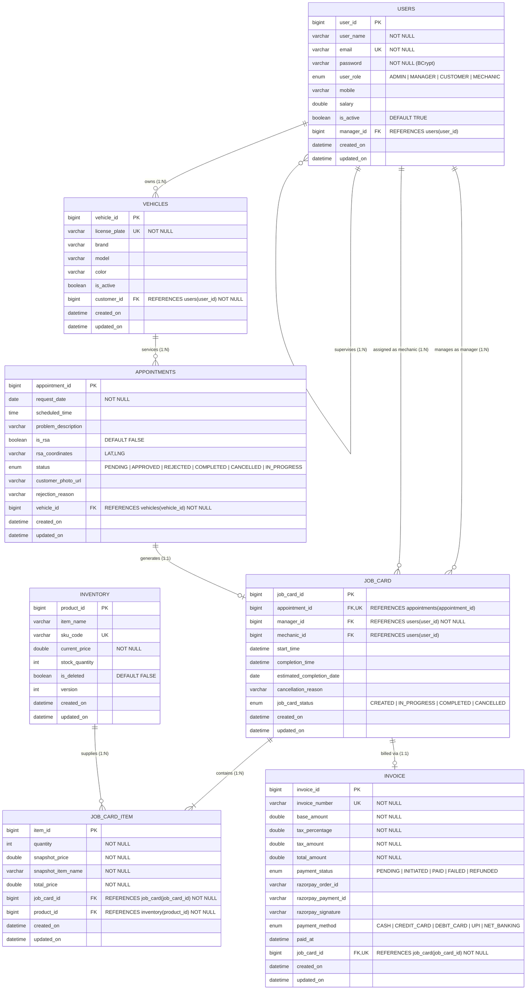
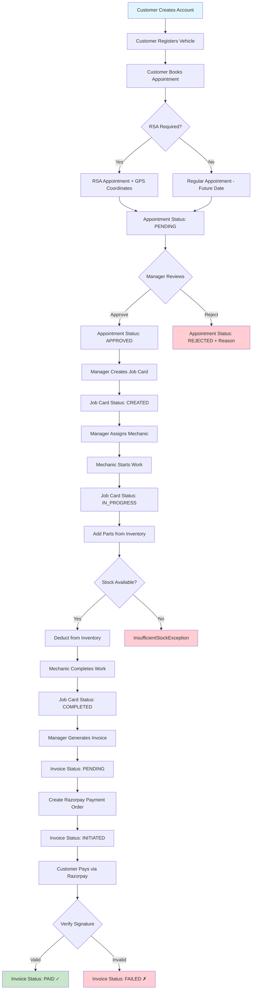
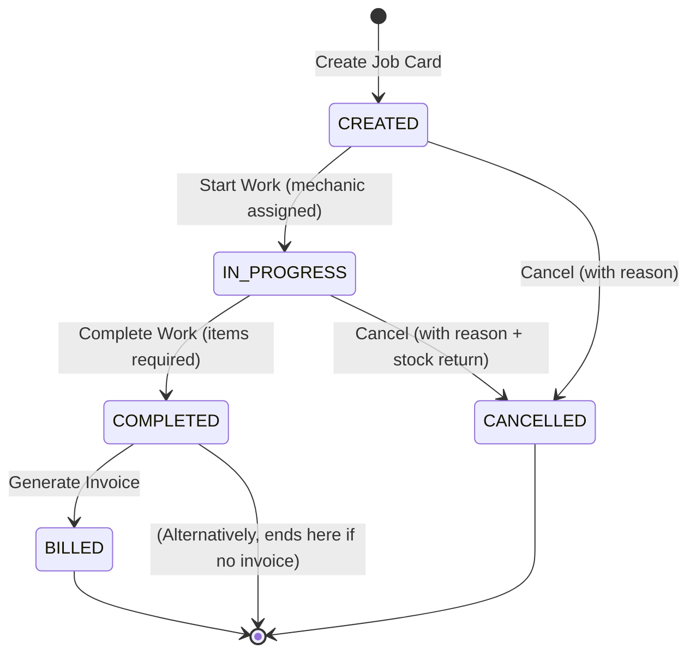

<p align="center">
  <h1 align="center">🚗 SmartServ — Vehicle Service Management Platform</h1>
  <p align="center">
    A comprehensive Spring Boot REST API for managing automobile service centers — from appointments and job cards to inventory, invoicing, and Razorpay-powered payments.
  </p>
</p>

<p align="center">
  
  
  
  
  
  
</p>

---

## 📑 Table of Contents

- [Overview](#-overview)
- [Key Features](#-key-features)
- [Tech Stack](#-tech-stack)
- [Architecture](#-architecture)
- [Project Structure](#-project-structure)
- [Database Schema (ER Model)](#-database-schema-er-model)
- [Entity Details](#-entity-details)
- [API Reference](#-api-reference)
  - [Health Check](#-health-check)
  - [User Management](#-user-management)
  - [Vehicle Management](#-vehicle-management)
  - [Appointment Management](#-appointment-management)
  - [Job Card Management](#-job-card-management)
  - [Inventory Management](#-inventory-management)
  - [Invoice & Payment Management](#-invoice--payment-management)
- [Role-Based Access Control](#-role-based-access-control)
- [Business Logic & Workflow](#-business-logic--workflow)
- [Error Handling](#-error-handling)
- [Configuration](#-configuration)
- [Getting Started](#-getting-started)
- [Docker Deployment](#-docker-deployment)
- [Environment Variables](#-environment-variables)
- [API Documentation (Swagger)](#-api-documentation-swagger)
- [License](#-license)

---

## 🌟 Overview

**SmartServ** is a full-featured backend REST API designed to digitize and streamline operations at automobile service centers. It manages the complete lifecycle of a vehicle service — from the moment a customer books an appointment, through the creation of job cards, parts allocation from inventory, work tracking by mechanics, invoice generation, and Razorpay-integrated online payment processing.

The system supports **four user roles** (Admin, Manager, Mechanic, Customer) with a hierarchical management structure, role-based validation, and a comprehensive dashboard system for managers and mechanics.

---

## 🔑 Key Features

| Module | Capabilities |
|---|---|
| **User Management** | Registration with BCrypt password hashing, role assignment (ADMIN, MANAGER, CUSTOMER, MECHANIC), manager-mechanic hierarchy, soft-delete |
| **Vehicle Management** | Vehicle registration linked to customers, lookup by license plate, soft-delete |
| **Appointment Scheduling** | Future-date validation, RSA (Roadside Assistance) with GPS coordinates, approve/reject workflow, status tracking |
| **Job Card System** | Full lifecycle (CREATED → IN_PROGRESS → COMPLETED/CANCELLED), mechanic assignment with manager authorization, parts management |
| **Inventory Management** | SKU-based tracking, optimistic locking for concurrency, low-stock/out-of-stock alerts, keyword search, soft-delete |
| **Invoice & Billing** | Auto-generation from completed job cards, configurable tax calculation, unique invoice numbering (INV-YYYY-NNNN) |
| **Payment Processing** | Razorpay order creation, HMAC-SHA256 signature verification, payment status tracking |
| **Dashboards** | Manager dashboard (total/in-progress/completed job counts), Mechanic dashboard (assigned/in-progress/completed) |
| **Monitoring** | Spring Boot Actuator for health checks, metrics, and application info |
| **API Documentation** | Auto-generated Swagger/OpenAPI UI via SpringDoc |

---

## 🛠 Tech Stack

| Layer | Technology | Version |
|---|---|---|
| **Language** | Java (OpenJDK) | 21 |
| **Framework** | Spring Boot | 3.5.16 |
| **Persistence** | Spring Data JPA + Hibernate | — |
| **Database** | MySQL | — |
| **Security** | Spring Security + BCrypt | — |
| **Authentication** | JWT (jjwt) | 0.13.0 |
| **Payment Gateway** | Razorpay Java SDK | 1.4.8 |
| **Object Mapping** | ModelMapper | 3.2.6 |
| **Validation** | Jakarta Bean Validation | — |
| **API Docs** | SpringDoc OpenAPI (Swagger UI) | 2.8.16 |
| **Utilities** | Apache Commons Lang 3, Lombok | 3.18.0 |
| **Env Management** | spring-dotenv | 4.0.0 |
| **Monitoring** | Spring Boot Actuator | — |
| **Build Tool** | Maven (with Maven Wrapper) | — |
| **Containerization** | Docker (Eclipse Temurin 21 JRE Alpine) | — |

---

## 🏗 Architecture

SmartServ follows a **layered architecture** pattern:

```
┌─────────────────────────────────────────────────┐
│                   CLIENT                        │
│          (Frontend / Postman / cURL)             │
└───────────────────┬─────────────────────────────┘
                    │  HTTP (REST)
                    ▼
┌─────────────────────────────────────────────────┐
│              CONTROLLER LAYER                   │
│  UserController, VehicleController,             │
│  AppointmentController, JobCardController,      │
│  InventoryController, InvoiceController         │
└───────────────────┬─────────────────────────────┘
                    │  DTOs (Request/Response)
                    ▼
┌─────────────────────────────────────────────────┐
│               SERVICE LAYER                     │
│  UserServiceImpl, VehicleServiceImpl,           │
│  AppointmentServiceImpl, JobCardServiceImpl,    │
│  InventoryServiceImpl, InvoiceServiceImpl       │
│  ┌────────────────────────────────────┐         │
│  │   Business Logic & Validation     │         │
│  │   ModelMapper (DTO ↔ Entity)      │         │
│  │   Razorpay Integration            │         │
│  └────────────────────────────────────┘         │
└───────────────────┬─────────────────────────────┘
                    │  JPA Entities
                    ▼
┌─────────────────────────────────────────────────┐
│             REPOSITORY LAYER                    │
│  UserRepository, VehicleRepository,             │
│  AppointmentRepository, JobCardRepository,      │
│  InventoryRepository, InvoiceRepository,        │
│  JobCardItemRepository                          │
└───────────────────┬─────────────────────────────┘
                    │  Spring Data JPA / Hibernate
                    ▼
┌─────────────────────────────────────────────────┐
│              MySQL DATABASE                     │
│  users, vehicles, appointments, job_card,       │
│  job_card_item, inventory, invoice              │
└─────────────────────────────────────────────────┘
```

### Cross-Cutting Concerns

```
┌─────────────────────────────────────────────────┐
│  SecurityConfig        → CSRF disabled,         │
│                          BCrypt PasswordEncoder  │
│  RazorpayConfig        → RazorpayClient bean    │
│  GlobalExceptionHandler→ Centralized errors     │
│  ModelMapper Bean      → Strict, non-null       │
│  Spring Boot Actuator  → Health & Metrics       │
│  spring-dotenv         → .env file loading      │
└─────────────────────────────────────────────────┘
```

---

## ⚡ Performance Optimizations

SmartServ features a deeply tuned data access layer that prevents common ORM performance pitfalls—specifically **Hidden N+1 Query Problems** caused during DTO mapping.

- **Explicit JPQL `JOIN FETCH`**: Highly nested dependencies (such as `JobCard` -> `Appointment` -> `Vehicle` -> `Customer`) are efficiently fetched using explicit JPQL queries with `JOIN FETCH` clauses in the repositories. This overrides Spring Data JPA's unreliable string-based `@EntityGraph` nested parsers, ensuring that large DTO projections are completed in a single query rather than firing hundreds of secondary select statements.
- **Lazy Loading Strategy**: By default, `@OneToOne` and `@ManyToOne` bindings use `FetchType.LAZY` to ensure the entity manager never cascades queries unintentionally unless explicitly overridden by a JPQL fetch directive.
- **Database Aggregations**: Financial and analytic summarization (like total workshop revenue) bypasses Java `Stream` mapping entirely and utilizes direct aggregate queries (e.g., `SELECT SUM(...) FROM...`) for immediate calculations.
- **Named Entity Graphs**: Standard `@NamedEntityGraph` mappings are integrated directly on root entities for fallback and future robust traversal.

---

## 📁 Project Structure

```
SmartServ/
├── .env                          # Local environment variables (gitignored)
├── .env.example                  # Environment variable template
├── .gitignore                    # Git ignore rules
├── Dockerfile                    # Docker container definition
├── LICENSE                       # Apache License 2.0
├── mvnw / mvnw.cmd               # Maven Wrapper scripts
├── pom.xml                       # Maven project configuration
│
└── src/
    ├── main/
    │   ├── java/com/smartserv/
    │   │   ├── SmartservApplication.java          # Entry point + ModelMapper bean
    │   │   │
    │   │   ├── config/
    │   │   │   ├── SecurityConfig.java            # Spring Security configuration
    │   │   │   └── RazorpayConfig.java            # Razorpay client bean
    │   │   │
    │   │   ├── entity/                            # JPA Entities
    │   │   │   ├── BaseEntity.java                # Common: id, createdOn, lastUpdated
    │   │   │   ├── User.java                      # Users table
    │   │   │   ├── Vehicle.java                   # Vehicles table
    │   │   │   ├── Appointment.java               # Appointments table
    │   │   │   ├── JobCard.java                   # Job cards table
    │   │   │   ├── JobCardItem.java               # Parts/items used in job
    │   │   │   ├── Inventory.java                 # Inventory/parts catalog
    │   │   │   ├── Invoice.java                   # Invoices table
    │   │   │   ├── Role.java                      # Enum: ADMIN, MANAGER, CUSTOMER, MECHANIC
    │   │   │   ├── Status.java                    # Enum: PENDING, APPROVED, REJECTED, etc.
    │   │   │   ├── JobCardStatus.java             # Enum: CREATED, IN_PROGRESS, COMPLETED, CANCELLED
    │   │   │   ├── PaymentStatus.java             # Enum: PENDING, INITIATED, PAID, FAILED, REFUNDED
    │   │   │   └── PaymentMethod.java             # Enum: CASH, CREDIT_CARD, DEBIT_CARD, UPI, NET_BANKING
    │   │   │
    │   │   ├── dto/                               # Data Transfer Objects
    │   │   │   ├── ApiResponse.java               # Standard API response wrapper
    │   │   │   ├── CreateUserDto.java             # User creation request
    │   │   │   ├── UpdateUserDto.java             # User update request
    │   │   │   ├── UserResponseDto.java           # User response
    │   │   │   ├── CreateVehicleDto.java          # Vehicle creation request
    │   │   │   ├── VehicleUpdateDto.java          # Vehicle update request
    │   │   │   ├── VehicleResponseDto.java        # Vehicle response
    │   │   │   ├── CreateAppointmentDto.java      # Appointment creation request
    │   │   │   ├── UpdateAppointmentDto.java      # Appointment update request
    │   │   │   ├── AppointmentResponseDto.java    # Appointment response
    │   │   │   ├── ApproveRejectDto.java          # Approve/Reject request
    │   │   │   ├── RsaLocationDto.java            # RSA GPS coordinates helper
    │   │   │   │
    │   │   │   ├── jobCard/                       # Job Card DTOs
    │   │   │   │   ├── CreateJobCardDto.java
    │   │   │   │   ├── JobCardResponseDto.java
    │   │   │   │   ├── AddItemToJobCardDto.java
    │   │   │   │   ├── AssignMechanicDto.java
    │   │   │   │   ├── CancelJobCardDto.java
    │   │   │   │   ├── JobCardItemDto.java
    │   │   │   │   ├── ManagerDashboardDto.java
    │   │   │   │   └── MechanicDashboardDto.java
    │   │   │   │
    │   │   │   ├── inventory/                     # Inventory DTOs
    │   │   │   │   ├── CreateInventoryDto.java
    │   │   │   │   ├── UpdateInventoryDto.java
    │   │   │   │   └── InventoryResponseDto.java
    │   │   │   │
    │   │   │   └── invoice/                       # Invoice DTOs
    │   │   │       ├── InvoiceResponseDto.java
    │   │   │       ├── InvoiceItemDto.java
    │   │   │       ├── CreatePaymentOrderResponseDto.java
    │   │   │       ├── VerifyPaymentRequestDto.java
    │   │   │       └── PaymentVerificationResponseDto.java
    │   │   │
    │   │   ├── repository/                        # Spring Data JPA Repositories
    │   │   │   ├── UserRepository.java
    │   │   │   ├── VehicleRepository.java
    │   │   │   ├── AppointmentRepository.java
    │   │   │   ├── JobCardRepository.java
    │   │   │   ├── JobCardItemRepository.java
    │   │   │   ├── InventoryRepository.java
    │   │   │   └── InvoiceRepository.java
    │   │   │
    │   │   ├── service/                           # Business Logic
    │   │   │   ├── UserService.java               # Interface
    │   │   │   ├── UserServiceImpl.java           # Implementation
    │   │   │   ├── VehicleService.java
    │   │   │   ├── VehicleServiceImpl.java
    │   │   │   ├── AppointmentService.java
    │   │   │   ├── AppointmentServiceImpl.java
    │   │   │   ├── JobCardService.java
    │   │   │   ├── JobCardServiceImpl.java
    │   │   │   ├── InventoryService.java
    │   │   │   ├── InventoryServiceImpl.java
    │   │   │   ├── InvoiceService.java
    │   │   │   └── InvoiceServiceImpl.java
    │   │   │
    │   │   ├── controller/                        # REST Controllers
    │   │   │   ├── HelloController.java           # Health check endpoint
    │   │   │   ├── UserController.java
    │   │   │   ├── VehicleController.java
    │   │   │   ├── AppointmentController.java
    │   │   │   ├── JobCardController.java
    │   │   │   ├── InventoryController.java
    │   │   │   └── InvoiceController.java
    │   │   │
    │   │   └── exceptions/                        # Custom Exceptions
    │   │       ├── GlobalExceptionHandler.java    # @RestControllerAdvice
    │   │       ├── ResourceAlreadyExists.java
    │   │       ├── ResourceNotFoundException.java
    │   │       ├── UserNotFoundException.java
    │   │       ├── JobCardNotFoundException.java
    │   │       ├── DuplicateJobCreationException.java
    │   │       ├── DuplicateInvoiceException.java
    │   │       ├── DuplicateSkuException.java
    │   │       ├── InsufficientStockException.java
    │   │       ├── StockConflictException.java
    │   │       ├── InvalidDateException.java
    │   │       ├── InvalidOperationException.java
    │   │       ├── InvalidRoleException.java
    │   │       ├── UnauthorizedException.java
    │   │       └── PaymentException.java
    │   │
    │   └── resources/
    │       └── application.properties             # Application configuration
    │
    └── test/                                      # Test sources
```

---

## 🗄 Database Schema (ER Model)



> **Notes**
> - `email`, `license_plate`, `sku_code`, and `invoice_number` are unique.
> - Each **Appointment** can have at most one **Job Card**.
> - Each **Job Card** can have at most one **Invoice**.

---

## 📋 Entity Details

### BaseEntity (Abstract — `@MappedSuperclass`)

All entities inherit from `BaseEntity`, which provides:

| Field | Type | Description |
|---|---|---|
| `id` | `Long` | Auto-generated primary key (`IDENTITY` strategy) |
| `createdOn` | `LocalDateTime` | Auto-set on creation (`@CreationTimestamp`) |
| `lastUpdated` | `LocalDateTime` | Auto-set on update (`@UpdateTimestamp`) |

### Enumerations

| Enum | Values |
|---|---|
| **Role** | `ADMIN`, `MANAGER`, `CUSTOMER`, `MECHANIC` |
| **Status** (Appointment) | `PENDING`, `APPROVED`, `REJECTED`, `COMPLETED`, `CANCELLED`, `IN_PROGRESS` |
| **JobCardStatus** | `CREATED`, `IN_PROGRESS`, `COMPLETED`, `CANCELLED` |
| **PaymentStatus** | `PENDING`, `INITIATED`, `PAID`, `FAILED`, `REFUNDED` |
| **PaymentMethod** | `CASH`, `CREDIT_CARD`, `DEBIT_CARD`, `UPI`, `NET_BANKING` |

---

## 📡 API Reference

**Base URL:** `http://localhost:{PORT}`  
**Default Port:** `8080` (configurable via `PORT` env variable)

---

### 🏥 Health Check

| Method | Endpoint | Description |
|---|---|---|
| `GET` | `/hello` | Returns application status message |

---

### 👥 User Management

**Base Path:** `/api/users`

| Method | Endpoint | Description |
|---|---|---|
| `POST` | `/api/users` | Register/create a new user (with `@Valid` DTO validation) |
| `GET` | `/api/users` (or `/api/users/getUsers`) | Get all active users |
| `GET` | `/api/users/{userId}` (or `/api/users/getUserById/{userId}`) | Get user by ID |
| `PUT` | `/api/users/{userId}` | Update user details |
| `DELETE` | `/api/users/{userId}` (or `/api/users/deleteUser/{userId}`) | Soft-delete user (set `isActive = false`) |
| `GET` | `/api/users/active` | Get all active users |
| `GET` | `/api/users/customers` | Get all customers |
| `GET` | `/api/users/customer/{customerId}` | Get customer by ID |
| `GET` | `/api/users/managers` | Get all managers |
| `GET` | `/api/users/manager/{managerId}` | Get manager by ID |
| `GET` | `/api/users/mechanics` | Get all mechanics |
| `GET` | `/api/users/mechanic/{mechanicId}` | Get mechanic by ID |
| `GET` | `/api/users/managers/{managerId}/mechanics` | Get mechanics under a manager |
| `PUT` | `/api/users/mechanics/{mechanicId}/assign_manager/{managerId}` | Assign a manager to a mechanic |

<details>
<summary><b>📋 Create User — Request Body</b></summary>

```json
{
  "userName": "John Doe",
  "email": "john@example.com",
  "password": "StrongP@ss1",
  "userRole": "CUSTOMER",
  "mobile": "9876543210",
  "salary": 50000.0,
  "isActive": true,
  "managerId": null
}
```

**Validation Rules:**
- `userName`: Required, 5–20 characters
- `email`: Required, valid email format
- `password`: Required, 8–20 chars, must contain digit + lowercase + uppercase + special character
- `userRole`: Required — `ADMIN`, `MANAGER`, `CUSTOMER`, or `MECHANIC`
- `mobile`: 10-digit number
- `salary`: Must be ≥ 1
- `managerId`: Optional (required for `MECHANIC` role assignment)

</details>

---

### 🚙 Vehicle Management

**Base Path:** `/api/vehicles`

| Method | Endpoint | Description |
|---|---|---|
| `POST` | `/api/vehicles` | Register a new vehicle |
| `GET` | `/api/vehicles` | Get all active vehicles |
| `GET` | `/api/vehicles/{vehicleId}` | Get vehicle by ID |
| `PUT` | `/api/vehicles/{vehicleId}` | Update vehicle details |
| `DELETE` | `/api/vehicles/{vehicleId}` | Soft-delete vehicle |
| `GET` | `/api/vehicles/license_plate/{licensePlate}` | Find vehicle by license plate |
| `GET` | `/api/vehicles/customer/{customerId}` | Get all vehicles for a customer |

<details>
<summary><b>📋 Create Vehicle — Request Body</b></summary>

```json
{
  "licensePlate": "MH12AB1234",
  "brand": "Maruti Suzuki",
  "model": "Swift",
  "color": "White",
  "customerId": 1
}
```

**Validation:** All fields required. `customerId` must reference a user with `CUSTOMER` role.

</details>

---

### 📅 Appointment Management

**Base Path:** `/api/appointments`

#### Customer Endpoints

| Method | Endpoint | Description |
|---|---|---|
| `POST` | `/api/appointments` | Create a new appointment |
| `PUT` | `/api/appointments/{appointmentId}` | Update appointment (PENDING only) |
| `DELETE` | `/api/appointments/{appointmentId}/cancel` | Cancel appointment (PENDING only) |
| `GET` | `/api/appointments/customer/{customerId}` | Get appointments by customer |
| `GET` | `/api/appointments/vehicle/{vehicleId}` | Get appointments by vehicle |

#### Manager Endpoints

| Method | Endpoint | Description |
|---|---|---|
| `GET` | `/api/appointments` | Get all appointments |
| `GET` | `/api/appointments/{appointmentId}` | Get appointment by ID |
| `GET` | `/api/appointments/pending` | Get all pending appointments |
| `GET` | `/api/appointments/status/{status}` | Get appointments by status |
| `PUT` | `/api/appointments/{appointmentId}/approve` | Approve appointment |
| `PUT` | `/api/appointments/{appointmentId}/reject` | Reject appointment (with reason) |
| `GET` | `/api/appointments/status/pending_count` | Get pending appointment count |

#### RSA (Roadside Assistance) Endpoints

| Method | Endpoint | Description |
|---|---|---|
| `GET` | `/api/appointments/rsa` | Get all RSA appointments |
| `GET` | `/api/appointments/rsa/pending` | Get pending RSA appointments |
| `GET` | `/api/appointments/rsa/{status}` | Get RSA appointments by status |
| `GET` | `/api/appointments/status/rsa_count` | Get total RSA count |

<details>
<summary><b>📋 Create Appointment — Request Body</b></summary>

```json
{
  "vehicleId": 1,
  "requestDate": "2026-08-15",
  "description": "Engine overheating issue",
  "rsa": false,
  "customerPhotoUrl": "https://example.com/photo.jpg",
  "rsaCoordinates": null
}
```

**RSA Appointment Example:**
```json
{
  "vehicleId": 1,
  "requestDate": "2026-08-01",
  "description": "Flat tire on highway",
  "rsa": true,
  "rsaCoordinates": "19.0760,72.8777"
}
```

**Validation:**
- `vehicleId`: Required
- `requestDate`: Required, must be in the future (except RSA)
- `description`: Required, max 500 characters
- If `rsa = true`, `rsaCoordinates` is required (format: `"latitude,longitude"`)
- Latitude: -90 to 90 | Longitude: -180 to 180

</details>

---

### 🔧 Job Card Management

**Base Path:** `/api/job_cards`

#### Job Card CRUD

| Method | Endpoint | Description |
|---|---|---|
| `POST` | `/api/job_cards` | Create a job card (from approved appointment) |
| `GET` | `/api/job_cards` | Get all job cards |
| `GET` | `/api/job_cards/{id}` | Get job card by ID |
| `GET` | `/api/job_cards/appointment/{appointmentId}` | Get job card by appointment ID |

#### Mechanic Management

| Method | Endpoint | Description |
|---|---|---|
| `PUT` | `/api/job_cards/{id}/assign_mechanic` | Assign mechanic to job card |
| `PUT` | `/api/job_cards/{id}/reassign_mechanic` | Reassign mechanic |

#### Status Transitions

| Method | Endpoint | Description |
|---|---|---|
| `PUT` | `/api/job_cards/{id}/start` | Start work (CREATED → IN_PROGRESS) |
| `PUT` | `/api/job_cards/{id}/complete` | Complete work (IN_PROGRESS → COMPLETED) |
| `DELETE` | `/api/job_cards/{id}/cancel` | Cancel job card (with reason) |

#### Items (Parts) Management

| Method | Endpoint | Description |
|---|---|---|
| `POST` | `/api/job_cards/{id}/items` | Add an inventory item to job card |
| `DELETE` | `/api/job_cards/{jobCardId}/items/{itemId}` | Remove item from job card |
| `GET` | `/api/job_cards/{id}/items` | Get job card items |

#### Query Endpoints

| Method | Endpoint | Description |
|---|---|---|
| `GET` | `/api/job_cards/manager/{managerId}` | Get job cards by manager |
| `GET` | `/api/job_cards/mechanic/{mechanicId}` | Get job cards by mechanic |
| `GET` | `/api/job_cards/status/{status}` | Get job cards by status |
| `GET` | `/api/job_cards/manager/{managerId}/status/{status}` | Manager's job cards by status |
| `GET` | `/api/job_cards/mechanic/{mechanicId}/status/{status}` | Mechanic's job cards by status |

#### Statistics Endpoints

| Method | Endpoint | Description |
|---|---|---|
| `GET` | `/api/job_cards/stats/total_count` | Total job card count |
| `GET` | `/api/job_cards/stats/in_progress` | In-progress job card count |
| `GET` | `/api/job_cards/stats/completed_count` | Completed job card count |
| `GET` | `/api/job_cards/stats/manager/{managerId}/count` | Manager's total job card count |
| `GET` | `/api/job_cards/stats/mechanic/{mechanicId}/count` | Mechanic's total job card count |

#### Dashboard Endpoints

| Method | Endpoint | Description |
|---|---|---|
| `GET` | `/api/job_cards/dashboard/manager/{managerId}` | Manager dashboard summary |
| `GET` | `/api/job_cards/dashboard/mechanic/{mechanicId}` | Mechanic dashboard summary |

<details>
<summary><b>📋 Create Job Card — Request Body</b></summary>

```json
{
  "appointmentId": 1,
  "managerId": 2,
  "mechanicId": 3,
  "estimatedCompletionDate": "2026-08-20"
}
```

**Business Rules:**
- Appointment must have `APPROVED` status
- Only one job card per appointment (duplicate prevention)
- Manager must have `MANAGER` role
- Mechanic must report to the specified manager
- Creating a job card sets appointment status to `IN_PROGRESS`

</details>

---

### 📦 Inventory Management

**Base Path:** `/api/inventory`

| Method | Endpoint | Description |
|---|---|---|
| `POST` | `/api/inventory` | Create new inventory item |
| `GET` | `/api/inventory` | Get all inventory items |
| `GET` | `/api/inventory/{id}` | Get item by ID |
| `GET` | `/api/inventory/sku/{skuCode}` | Get item by SKU code |
| `PUT` | `/api/inventory/{id}` | Update item |
| `DELETE` | `/api/inventory/{id}` | Soft-delete item |
| `GET` | `/api/inventory/available` | Get items in stock (`quantity > 0`) |
| `GET` | `/api/inventory/low_stock` | Get items with quantity < 10 |
| `GET` | `/api/inventory/out_of_stock` | Get items with quantity = 0 |
| `GET` | `/api/inventory/search?keyword={keyword}` | Search items by name or SKU |

<details>
<summary><b>📋 Create Inventory Item — Request Body</b></summary>

```json
{
  "itemName": "Brake Pad Set",
  "skuCode": "BRK-PAD-001",
  "currentPrice": 2500.00,
  "stockQuantity": 50
}
```

**Features:**
- Optimistic locking via `@Version` for concurrent stock updates
- Duplicate SKU prevention
- Low stock threshold: 10 units
- Soft-delete (items marked as `deleted` cannot be used in job cards)

</details>

---

### 💰 Invoice & Payment Management

**Base Path:** `/api/invoices`

#### Invoice Generation

| Method | Endpoint | Description |
|---|---|---|
| `POST` | `/api/invoices/generate/job_card/{jobCardId}` | Generate invoice from completed job card |
| `GET` | `/api/invoices` | Get all invoices |
| `GET` | `/api/invoices/{id}` | Get invoice by ID |
| `GET` | `/api/invoices/number/{invoiceNumber}` | Get invoice by number |
| `GET` | `/api/invoices/job_card/{jobCardId}` | Get invoice by job card ID |
| `GET` | `/api/invoices/customer/{customerId}` | Get invoices by customer |
| `GET` | `/api/invoices/status/{status}` | Get invoices by payment status |

#### Payment Operations (Razorpay)

| Method | Endpoint | Description |
|---|---|---|
| `POST` | `/api/invoices/{id}/create_payment_order` | Create Razorpay payment order |
| `POST` | `/api/invoices/{id}/verify_payment` | Verify Razorpay payment signature |

#### Statistics

| Method | Endpoint | Description |
|---|---|---|
| `GET` | `/api/invoices/stats/total_count` | Total invoices count |
| `GET` | `/api/invoices/stats/pending_count` | Pending payment count |
| `GET` | `/api/invoices/stats/paid_count` | Paid invoices count |
| `GET` | `/api/invoices/stats/total_revenue` | Total revenue (sum of paid invoices) |

<details>
<summary><b>📋 Verify Payment — Request Body</b></summary>

```json
{
  "razorpayOrderId": "order_XXXXXXXXXXXXX",
  "razorpayPaymentId": "pay_XXXXXXXXXXXXX",
  "razorpaySignature": "hmac_sha256_signature_here",
  "paymentMethod": "UPI"
}
```

**Invoice Number Format:** `INV-{YEAR}-{SEQUENTIAL_NUMBER}` (e.g., `INV-2026-0001`)

**Tax Calculation:**
- `baseAmount` = sum of all job card items' total prices
- `taxAmount` = `baseAmount × taxPercentage / 100`
- `totalAmount` = `baseAmount + taxAmount`
- Default `taxPercentage`: 18% (configurable)

</details>

---

## 🔐 Role-Based Access Control

| Role | Permissions |
|---|---|
| **ADMIN** | Full system access |
| **MANAGER** | Approve/reject appointments, create/manage job cards, assign mechanics, generate invoices, view dashboards |
| **MECHANIC** | Start/complete work on assigned job cards, add inventory parts/items |
| **CUSTOMER** | Create appointments, view own appointments/vehicles/invoices, make payments |

### Manager-Mechanic Hierarchy

```
Manager
 ├── Mechanic A
 ├── Mechanic B
 └── Mechanic C
```

- Mechanics are assigned to managers via `manager_id` FK
- A mechanic can only be assigned to job cards managed by their manager
- Manager authorization is validated during mechanic assignment

> **Note:** Endpoints are secured using JWT-based authentication via an `HttpOnly` cookie. Spring Security is configured with `@EnableMethodSecurity` to enforce role-based access control (RBAC) across controllers using `@PreAuthorize` tags. The application also includes ownership validation (e.g., verifying `customerId` against the authenticated token) to prevent Insecure Direct Object Reference (IDOR) vulnerabilities.
---

## 🔄 Business Logic & Workflow

### Complete Service Workflow



### Job Card Status State Machine



### Inventory Stock Management

When **adding items** to a job card:
1. Validates stock availability
2. Deducts quantity from inventory
3. Creates a **snapshot** of item name and price (price protection)
4. Uses **optimistic locking** (`@Version`) to prevent race conditions

When **removing items** or **cancelling** a job card:
1. Returns quantity back to inventory
2. Removes the job card item record

---

## ⚠️ Error Handling

SmartServ uses a centralized `GlobalExceptionHandler` (`@RestControllerAdvice`) that returns consistent error responses:

### Standard Error Response

```json
{
  "timestamp": "2026-07-30T12:00:00",
  "message": "Descriptive error message",
  "status": "Error category"
}
```

### Exception Mapping

| Exception | HTTP Status | Description |
|---|---|---|
| `ResourceAlreadyExists` | `409 CONFLICT` | Duplicate email, license plate, etc. |
| `ResourceNotFoundException` | `404 NOT FOUND` | Entity not found by ID |
| `UserNotFoundException` | `401 UNAUTHORIZED` | User does not exist |
| `InvalidRoleException` | `401 UNAUTHORIZED` | Role mismatch (e.g., assigning non-mechanic) |
| `UnauthorizedException` | `401 UNAUTHORIZED` | Mechanic doesn't report to manager |
| `DuplicateJobCreationException` | `409 CONFLICT` | Job card already exists for appointment |
| `DuplicateInvoiceException` | `409 CONFLICT` | Invoice already generated for job card |
| `DuplicateSkuException` | `409 CONFLICT` | SKU code already exists |
| `InvalidDateException` | `400 BAD REQUEST` | Past date for appointment |
| `InvalidOperationException` | `500 INTERNAL SERVER ERROR` | Invalid status transition |
| `InsufficientStockException` | `500 INTERNAL SERVER ERROR` | Not enough stock |
| `StockConflictException` | `500 INTERNAL SERVER ERROR` | Optimistic lock failure |
| `PaymentException` | `400 BAD REQUEST` | Razorpay payment/verification failure |
| `MethodArgumentNotValidException` | `400 BAD REQUEST` | Bean validation failures (field-level errors) |
| `RuntimeException` (generic) | `500 INTERNAL SERVER ERROR` | Unexpected server errors |

### Validation Error Response (Field-Level)

```json
{
  "userName": "Name must be between 5 and 20",
  "email": "must not be blank",
  "password": "Password must contain at least one digit..."
}
```

---

## ⚙️ Configuration

### `application.properties`

```properties
# Application
spring.application.name=smartserv

# Server
server.port=${PORT:8080}
server.shutdown=graceful

# Database (MySQL)
spring.datasource.url=${DB_URL}
spring.datasource.username=${DB_USERNAME}
spring.datasource.password=${DB_PASSWORD}
spring.datasource.driver-class-name=com.mysql.cj.jdbc.Driver
spring.jpa.database-platform=org.hibernate.dialect.MySQLDialect
spring.jpa.open-in-view=false
spring.jpa.show-sql=true
spring.jpa.hibernate.ddl-auto=update

# Security
logging.level.org.springframework.security=debug

# JWT
jwt.secret=${JWT_SECRET}
jwt.expiration=${JWT_EXPIRATION}

# Razorpay
razorpay.key.id=${RAZORPAY_KEY_ID}
razorpay.key.secret=${RAZORPAY_KEY_SECRET}

# Invoice Tax
invoice.tax.percentage=${INVOICE_TAX_PERCENTAGE:18}

# Actuator
management.endpoints.web.exposure.include=${MANAGEMENT_ENDPOINTS_WEB_EXPOSURE_INCLUDE}
management.endpoint.health.show-details=${HEALTH_SHOW_DETAILS}
```

### ModelMapper Configuration

Configured in `SmartservApplication.java`:
- **Matching Strategy:** `STRICT` — prevents accidental field mapping
- **Property Condition:** `isNotNull` — skips null fields during mapping (supports partial updates)

---

## 🚀 Getting Started

### Prerequisites

- **Java 21** (JDK)
- **MySQL** 8.0+
- **Maven** 3.9+ (or use the included Maven Wrapper)
- **Razorpay Account** (for payment features — [Sign up](https://razorpay.com))

### Setup

1. **Clone the repository:**
   ```bash
   git clone https://github.com/shivamghaware/SmartServ.git
   cd SmartServ
   ```

2. **Create the `.env` file:**
   ```bash
   cp .env.example .env
   ```

3. **Configure your `.env` file:**
   ```env
   # Database
   DB_URL=jdbc:mysql://localhost:3306/smartserv?createDatabaseIfNotExist=true&useSSL=false&allowPublicKeyRetrieval=true
   DB_USERNAME=root
   DB_PASSWORD=your_password

   # Server
   PORT=8080

   # JWT
   JWT_SECRET=your-512-bit-secret-key
   JWT_EXPIRATION=7200000

   # Razorpay
   RAZORPAY_KEY_ID=rzp_test_XXXXX
   RAZORPAY_KEY_SECRET=XXXXXXXXXXXXX

   # Invoice
   INVOICE_TAX_PERCENTAGE=18

   # Actuator
   MANAGEMENT_ENDPOINTS_WEB_EXPOSURE_INCLUDE=health,info
   HEALTH_SHOW_DETAILS=always
   ```

4. **Build and run:**
   ```bash
   # Using Maven Wrapper (no Maven installation needed)
   ./mvnw spring-boot:run

   # Or on Windows
   mvnw.cmd spring-boot:run
   ```

5. **Access the application:**
   - API Base: `http://localhost:8080`
   - Swagger UI: `http://localhost:8080/swagger-ui.html`
   - Health Check: `http://localhost:8080/actuator/health`

---

## 🐳 Docker Deployment

### Dockerfile

```dockerfile
FROM eclipse-temurin:21-jre-alpine
WORKDIR /app
COPY target/*.jar app.jar
EXPOSE 8080
ENTRYPOINT ["java", "-jar", "app.jar"]
```

### Build & Run

```bash
# 1. Build the JAR
./mvnw clean package -DskipTests

# 2. Build Docker image
docker build -t smartserv:latest .

# 3. Run the container
docker run -d \
  --name smartserv \
  -p 8080:8080 \
  --env-file .env \
  smartserv:latest
```

---

## 🔐 Environment Variables

| Variable | Required | Default | Description |
|---|---|---|---|
| `DB_URL` | ✅ | — | MySQL JDBC connection URL |
| `DB_USERNAME` | ✅ | — | Database username |
| `DB_PASSWORD` | ✅ | — | Database password |
| `PORT` | ❌ | `8080` | Server port |
| `JWT_SECRET` | ✅ | — | 512-bit secret key for JWT signing |
| `JWT_EXPIRATION` | ✅ | — | JWT token expiration in milliseconds |
| `RAZORPAY_KEY_ID` | ✅ | — | Razorpay API Key ID |
| `RAZORPAY_KEY_SECRET` | ✅ | — | Razorpay API Key Secret |
| `INVOICE_TAX_PERCENTAGE` | ❌ | `18` | Tax percentage applied to invoices |
| `CORS_ALLOWED_ORIGINS` | ❌ | `http://localhost:5173,...` | Comma-separated list of allowed frontend origins for CORS |
| `SECURE_COOKIE` | ❌ | `false` | Set to `true` in production to enforce HTTPS-only JWT cookies |
| `SHOW_SQL` | ❌ | `false` | Set to `true` to enable SQL query logging in development |
| `MANAGEMENT_ENDPOINTS_WEB_EXPOSURE_INCLUDE` | ❌ | — | Actuator endpoints to expose |
| `HEALTH_SHOW_DETAILS` | ❌ | — | Actuator health detail level |

---

## 📖 API Documentation (Swagger)

SmartServ integrates **SpringDoc OpenAPI** for automatic API documentation generation.

Once the application is running, access the Swagger UI at:

```
http://localhost:{PORT}/swagger-ui.html
```

Or the raw OpenAPI JSON spec:

```
http://localhost:{PORT}/v3/api-docs
```

---

## 📄 License

This project is licensed under the **Apache License 2.0** — see the [LICENSE](LICENSE) file for details.

---

<p align="center">
  <b>Built with ❤️ using Spring Boot</b>
</p>
