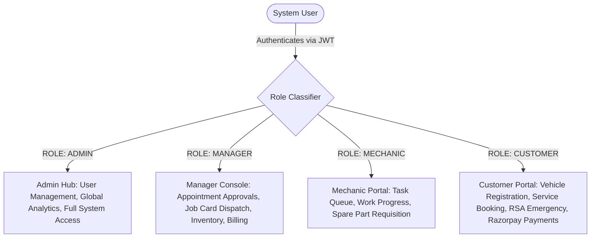
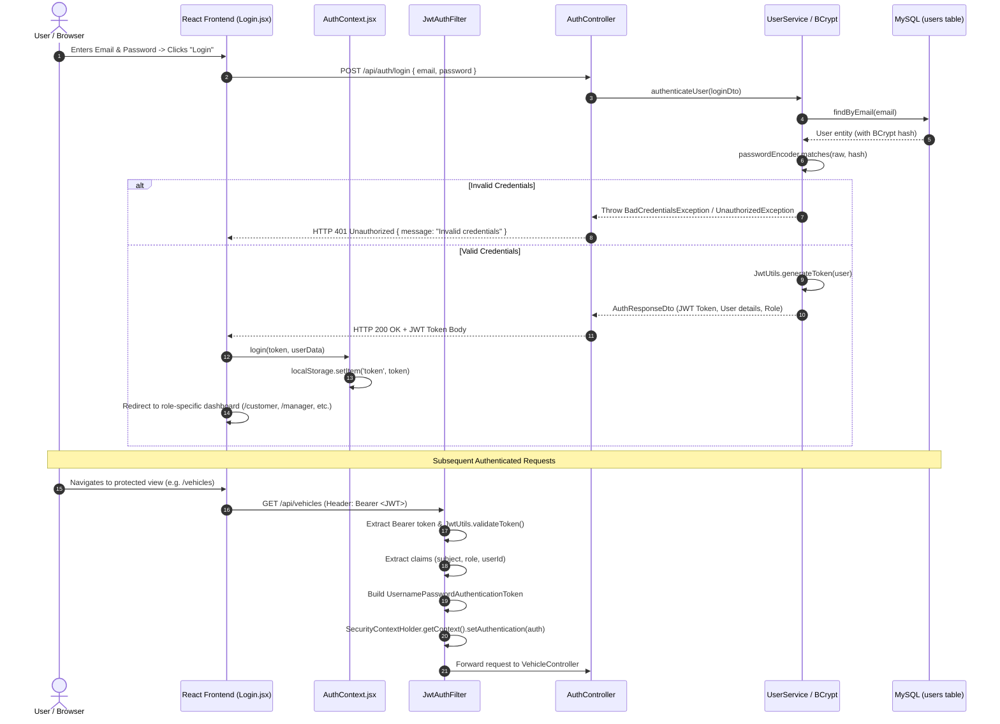
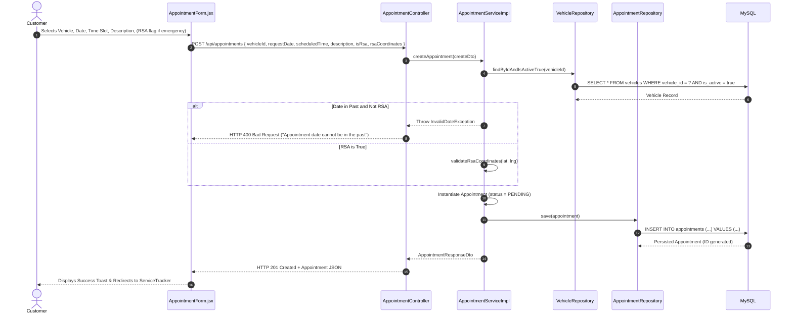
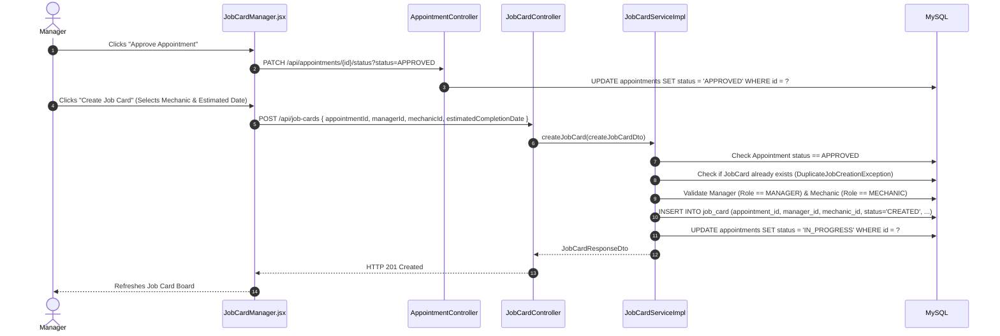
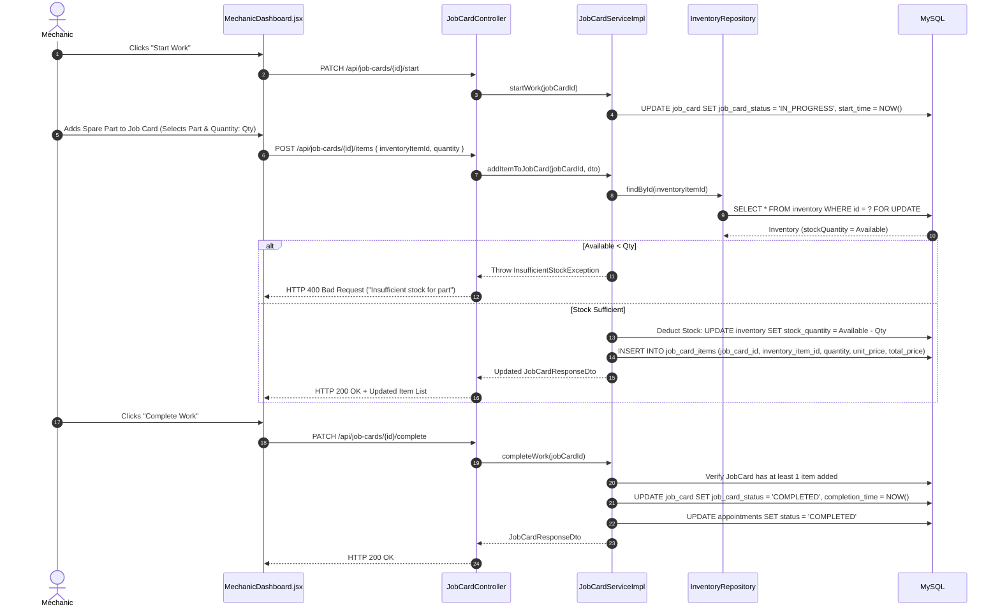
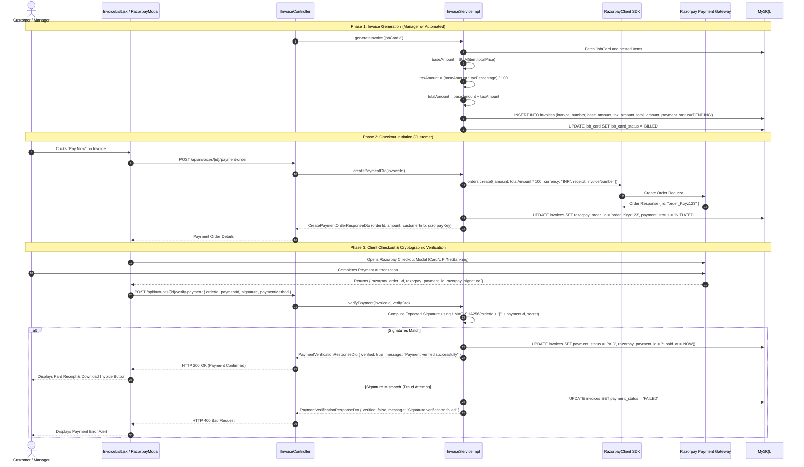

# Code Base Walkthrough & Execution Flow
**SmartServ – Enterprise Automobile Service Management Platform**
*Architectural Specification & Technical Walkthrough Document*

---

## 1. High-Level Architecture Summary

### 1.1 System Overview
**SmartServ** is an enterprise-grade automobile service management platform engineered to automate end-to-end garage operations, customer engagement, vehicle lifecycle servicing, inventory control, billing, and emergency roadside assistance (RSA). 

The platform is designed following a **decoupled, multi-tier client-server architecture** utilizing a stateless RESTful API backend built on **Spring Boot 3.5 (Java 21)** and an interactive Single Page Application (SPA) frontend built on **React 19 + Vite**.

```
+-----------------------------------------------------------------------------------+
|                                 CLIENT TIER                                       |
|  React 19 SPA (Vite) + React Router v7 + Framer Motion + Bootstrap 5.3 + Axios    |
|      [Customer Portal]  |  [Manager Portal]  |  [Mechanic View]  |  [Admin Hub]   |
+-----------------------------------------------------------------------------------+
                                         │  HTTPS / JSON
                                         ▼
+-----------------------------------------------------------------------------------+
|                            API & SECURITY GATEWAY                                 |
|      Spring Security 6 Filter Chain (CORS, CSRF Disabled, Stateless JWT Filter)   |
+-----------------------------------------------------------------------------------+
                                         │
                                         ▼
+-----------------------------------------------------------------------------------+
|                             CONTROLLER / REST LAYER                               |
|   AuthController | UserController | VehicleController | AppointmentController     |
|       JobCardController | InventoryController | InvoiceController                 |
+-----------------------------------------------------------------------------------+
                                         │  DTOs / Validations (@Valid)
                                         ▼
+-----------------------------------------------------------------------------------+
|                              SERVICE / DOMAIN LAYER                               |
|   - Business Rule Validation & Domain Exceptions                                  |
|   - State Machine Orchestration (Appointments, JobCards, Invoices)                |
|   - Cryptographic Signature Verifier (Razorpay HMAC-SHA256)                       |
|   - Inventory Stock Mutation & Concurrency Controls                               |
+-----------------------------------------------------------------------------------+
                                         │  JPA / Hibernate / Entity Graphs
                                         ▼
+-----------------------------------------------------------------------------------+
|                            DATA ACCESS / REPOSITORY TIER                         |
|   Spring Data JPA Repositories (Derived Queries, Custom JPQL, NamedEntityGraphs)  |
+-----------------------------------------------------------------------------------+
                                         │  JDBC / Connection Pooling
                                         ▼
+-----------------------------------------------------------------------------------+
|                                DATABASE TIER                                      |
|                                MySQL 8.x Database                                 |
+-----------------------------------------------------------------------------------+
```

---

### 1.2 Technology Stack

| Layer | Technologies & Libraries | Architectural Purpose |
| :--- | :--- | :--- |
| **Backend Core** | Java 21, Spring Boot 3.5.16 | Modern LTS Java runtime, dependency injection, autoconfiguration |
| **Security** | Spring Security 6, JJWT 0.13.0, BCrypt | Stateless JWT Bearer token authentication, method-level authorization (`@EnableMethodSecurity`), password hashing |
| **Persistence** | Spring Data JPA, Hibernate, MySQL Connector/J | ORM mapping, relational data persistence, transaction management (`@Transactional`) |
| **Third-Party APIs** | Razorpay Java SDK 1.4.8, JSON 20250517 | Payment gateway order generation, checkout integration, HMAC-SHA256 signature verification |
| **Mapping & Utils** | ModelMapper 3.2.6, Lombok, Commons Lang 3 | Object graph transformation (Entity ↔ DTO), boilerplate elimination |
| **API Docs & Monitoring**| SpringDoc OpenAPI 2.8.16 (Swagger UI), Spring Boot Actuator | Living API contracts, health checks, operational metrics |
| **Frontend Core** | React 19.2, Vite 8, React Router DOM 7.18 | Component-based UI, reactive state, client-side routing with role-based guards |
| **State & Networking** | Context API (`AuthContext`, `ThemeContext`), Axios 1.19 | Centralized token management, automatic request authorization header injection |
| **Forms & Validation** | React Hook Form 7.84, Yup 1.7, `@hookform/resolvers` | Client-side schema validation, controlled performance-optimized forms |
| **UI & Animations** | Bootstrap 5.3, React-Bootstrap 2.10, Bootstrap Icons, Framer Motion 12.43, React Toastify | Responsive grid, glassmorphism styling, animated transitions, toast feedback |

---

### 1.3 Role-Based Access Control (RBAC) Architecture

SmartServ partitions platform capabilities across four distinct actor profiles:



---

## 2. Project Directory Structure & Responsibility Breakdown

```
SmartServ/
├── pom.xml                                  # Maven dependencies & build lifecycle configuration
├── Dockerfile                               # Containerization specification
├── README.md                                # Setup instructions & platform summary
├── SmartServ_UseCase_Diagram.md             # Formal use case mapping & system boundary definitions
├── src/main/resources/
│   └── application.properties               # Database, JWT, Razorpay, and logging configuration
├── src/main/java/com/smartserv/
│   ├── SmartservApplication.java            # Spring Boot application bootstrap entry point
│   ├── config/                              # Infrastructure & framework configurations
│   ├── controller/                          # REST API endpoints (Web layer)
│   ├── dto/                                 # Data Transfer Objects (Payload contracts)
│   ├── entity/                              # JPA Domain entities (Data model)
│   ├── exceptions/                          # Global exception hierarchy & centralized handler
│   ├── repository/                          # Spring Data JPA persistence interfaces
│   ├── security/                            # JWT filters, token providers & security utilities
│   └── service/                             # Business logic interfaces & transactional implementations
└── SmartServFrontEnd/
    ├── package.json                         # Node.js dependencies and build scripts
    ├── vite.config.js                       # Vite bundler & proxy configuration
    └── src/
        ├── App.jsx                          # Root router, role guards, layout orchestration
        ├── main.jsx                         # React DOM root mounting & providers
        ├── api/                             # Axios client & global interceptors
        ├── context/                         # React context (Auth & Theme state)
        ├── layouts/                         # Shared shells (AuthLayout, DashboardLayout)
        ├── pages/                           # Screen views grouped by feature/role
        ├── services/                        # Frontend API consumer modules
        └── utils/                           # Helper utilities (formatters, validators)
```

---

### 2.1 Backend Package & Component Matrix

#### `com.smartserv.config`
- [SecurityConfig.java](file:///c:/Shivam%20New/PROJECT%202026/SmartServ/src/main/java/com/smartserv/config/SecurityConfig.java): Configures `SecurityFilterChain`, disables CSRF for stateless REST, sets up fine-grained CORS origin/method policies, enforces `STATELESS` session creation, and injects `JwtAuthFilter`.
- [RazorpayConfig.java](file:///c:/Shivam%20New/PROJECT%202026/SmartServ/src/main/java/com/smartserv/config/RazorpayConfig.java): Instantiates the singleton `RazorpayClient` bean using credentials from environment variables (`RAZORPAY_KEY_ID`, `RAZORPAY_KEY_SECRET`).

#### `com.smartserv.security`
- [JwtUtils.java](file:///c:/Shivam%20New/PROJECT%202026/SmartServ/src/main/java/com/smartserv/security/JwtUtils.java): Encapsulates HMAC-SHA signing key initialization, token creation with custom claims (`id`, `userId`, `role`, `userName`), token validation, and claim extraction.
- [JwtAuthFilter.java](file:///c:/Shivam%20New/PROJECT%202026/SmartServ/src/main/java/com/smartserv/security/JwtAuthFilter.java): Extends `OncePerRequestFilter`. Intercepts incoming HTTP requests, extracts `Bearer` token from `Authorization` header, validates signature, builds `UsernamePasswordAuthenticationToken`, and populates Spring's `SecurityContextHolder`.

#### `com.smartserv.entity`
- [BaseEntity.java](file:///c:/Shivam%20New/PROJECT%202026/SmartServ/src/main/java/com/smartserv/entity/BaseEntity.java): `@MappedSuperclass` providing standardized `id` (Auto Identity), `createdOn` (`@CreationTimestamp`), and `lastUpdated` (`@UpdateTimestamp`) audit fields.
- [User.java](file:///c:/Shivam%20New/PROJECT%202026/SmartServ/src/main/java/com/smartserv/entity/User.java): Stores user accounts, BCrypt hashed passwords, mobile numbers, and associated `Role` (`ADMIN`, `MANAGER`, `CUSTOMER`, `MECHANIC`).
- [Vehicle.java](file:///c:/Shivam%20New/PROJECT%202026/SmartServ/src/main/java/com/smartserv/entity/Vehicle.java): Represents vehicles owned by a customer (Registration number, Make, Model, Year, Fuel Type, Active status).
- [Appointment.java](file:///c:/Shivam%20New/PROJECT%202026/SmartServ/src/main/java/com/smartserv/entity/Appointment.java): Captures service bookings, scheduled dates/slots, problem descriptions, customer photo URLs, emergency RSA flags, GPS coordinates, and current `Status` (`PENDING`, `APPROVED`, `IN_PROGRESS`, `COMPLETED`, `CANCELLED`).
- [JobCard.java](file:///c:/Shivam%20New/PROJECT%202026/SmartServ/src/main/java/com/smartserv/entity/JobCard.java): Central operational entity linked to an `Appointment`, managed by a `Manager`, assigned to a `Mechanic`. Declares `@NamedEntityGraph("JobCard.deep")` to eagerly load nested relations and prevent N+1 query bottlenecks. Tracks lifecycle (`JobCardStatus`).
- [JobCardItem.java](file:///c:/Shivam%20New/PROJECT%202026/SmartServ/src/main/java/com/smartserv/entity/JobCardItem.java): Join entity between `JobCard` and `Inventory`. Records unit price, quantity consumed, and total price.
- [Inventory.java](file:///c:/Shivam%20New/PROJECT%202026/SmartServ/src/main/java/com/smartserv/entity/Inventory.java): Spare parts inventory tracking SKU, item name, unit price, stock quantity, minimum threshold, and soft deletion flag.
- [Invoice.java](file:///c:/Shivam%20New/PROJECT%202026/SmartServ/src/main/java/com/smartserv/entity/Invoice.java): Billing record linked 1-to-1 with a completed `JobCard`. Stores base item total, tax percentage, tax amount, total amount, Razorpay order/payment IDs, signature, payment method, and `PaymentStatus` (`PENDING`, `INITIATED`, `PAID`, `FAILED`).

#### `com.smartserv.controller` & `com.smartserv.service`
- **Auth**: [AuthController.java](file:///c:/Shivam%20New/PROJECT%202026/SmartServ/src/main/java/com/smartserv/controller/AuthController.java) & [UserServiceImpl.java](file:///c:/Shivam%20New/PROJECT%202026/SmartServ/src/main/java/com/smartserv/service/UserServiceImpl.java) handle user registration, credential verification, and JWT minting.
- **Vehicle**: [VehicleController.java](file:///c:/Shivam%20New/PROJECT%202026/SmartServ/src/main/java/com/smartserv/controller/VehicleController.java) & [VehicleServiceImpl.java](file:///c:/Shivam%20New/PROJECT%202026/SmartServ/src/main/java/com/smartserv/service/VehicleServiceImpl.java) manage customer vehicle records with soft deletion support.
- **Appointment**: [AppointmentController.java](file:///c:/Shivam%20New/PROJECT%202026/SmartServ/src/main/java/com/smartserv/controller/AppointmentController.java) & [AppointmentServiceImpl.java](file:///c:/Shivam%20New/PROJECT%202026/SmartServ/src/main/java/com/smartserv/service/AppointmentServiceImpl.java) handle regular and RSA emergency appointments, date validation, and status updates.
- **Job Card**: [JobCardController.java](file:///c:/Shivam%20New/PROJECT%202026/SmartServ/src/main/java/com/smartserv/controller/JobCardController.java) & [JobCardServiceImpl.java](file:///c:/Shivam%20New/PROJECT%202026/SmartServ/src/main/java/com/smartserv/service/JobCardServiceImpl.java) coordinate garage job cards, mechanic assignment, work execution timestamps, spare part additions, stock deduction, and cancellation rollbacks.
- **Inventory**: [InventoryController.java](file:///c:/Shivam%20New/PROJECT%202026/SmartServ/src/main/java/com/smartserv/controller/InventoryController.java) & [InventoryServiceImpl.java](file:///c:/Shivam%20New/PROJECT%202026/SmartServ/src/main/java/com/smartserv/service/InventoryServiceImpl.java) provide stock management, low-stock alerts, and restocking logic.
- **Invoice & Payments**: [InvoiceController.java](file:///c:/Shivam%20New/PROJECT%202026/SmartServ/src/main/java/com/smartserv/controller/InvoiceController.java) & [InvoiceServiceImpl.java](file:///c:/Shivam%20New/PROJECT%202026/SmartServ/src/main/java/com/smartserv/service/InvoiceServiceImpl.java) compute billing totals with tax, interface with Razorpay API to generate orders, and cryptographically verify payment signatures.

#### `com.smartserv.exceptions`
- [GlobalExceptionHandler.java](file:///c:/Shivam%20New/PROJECT%202026/SmartServ/src/main/java/com/smartserv/exceptions/GlobalExceptionHandler.java): `@RestControllerAdvice` converting domain exceptions (`ResourceNotFoundException`, `InsufficientStockException`, `DuplicateJobCreationException`, `PaymentException`, `MethodArgumentNotValidException`) into standardized JSON error responses with HTTP status codes (400, 401, 403, 404, 409, 500).

---

### 2.2 Frontend Architecture & Directory Matrix

```
SmartServFrontEnd/src/
├── api/
│   └── axiosConfig.js         # Central Axios instance with JWT Authorization request interceptor
├── context/
│   ├── AuthContext.jsx        # Auth provider holding user object, JWT token, role, login/logout actions
│   └── ThemeContext.jsx       # Theme state provider (Dark/Light mode)
├── layouts/
│   ├── AuthLayout.jsx         # Centered container shell for Login and Register pages
│   └── DashboardLayout.jsx    # Responsive shell containing TopNav, Sidebar navigation, and <Outlet />
├── pages/
│   ├── Admin/                 # Admin Dashboard, User Management, Global Reports
│   ├── Appointments/          # Appointment list, Booking form, RSA request view
│   ├── Auth/                  # Login.jsx, Register.jsx
│   ├── Customer/              # Customer Dashboard, Service Tracker, Profile Settings
│   ├── Error/                 # 404 Not Found, 401/403 Unauthorized, 500 Server Error
│   ├── Inventory/             # Inventory catalog, Stock replenishment form
│   ├── Invoices/              # Invoices overview, Invoice detail modal, Razorpay checkout modal
│   ├── Manager/               # Manager Dashboard, Pending Appointments, Job Card assignment manager
│   ├── Mechanic/              # Mechanic Dashboard (Active tasks, status updater, item requisition)
│   ├── Users/                 # User CRUD screens
│   └── Vehicles/              # Customer vehicle management screens
└── services/                  # Modular API connectors (Auth, Appointment, Inventory, Invoice, JobCard, Vehicle)
```

---

## 3. Step-by-Step Execution Flows for Main User Interactions

### 3.1 Flow 1: User Authentication & JWT Security Context Hydration



---

### 3.2 Flow 2: Vehicle Registration & Service Appointment Scheduling



---

### 3.3 Flow 3: Manager Appointment Approval, Job Card Creation & Mechanic Assignment



---

### 3.4 Flow 4: Mechanic Service Execution & Inventory Deduction Flow



---

### 3.5 Flow 5: Invoice Generation, Razorpay Payment Order & Cryptographic Signature Verification



---

## 4. Key Algorithms, Design Patterns & Custom Logic

### 4.1 Architectural & Design Patterns

```
+------------------------------------+-----------------------------------------------------------------------------------------+
| Design Pattern                     | Concrete Implementation in SmartServ                                                    |
+------------------------------------+-----------------------------------------------------------------------------------------+
| Layered Architecture               | Controller -> Service -> Repository -> Database separation of concerns                  |
| Intercepting Filter Pattern        | JwtAuthFilter intercepts every incoming HTTP call before it reaches the DispatcherServlet|
| Data Transfer Object (DTO)         | Strict separation of internal entities and external API contracts with @Valid validation |
| Named Entity Graph (Fetch Plan)   | @NamedEntityGraph on JobCard resolves deep nested relations without N+1 query overhead |
| Global Exception Handler           | Centralized @RestControllerAdvice captures domain exceptions into standard error DTOs   |
| Factory / Client Adapter Pattern   | RazorpayClient wrapper for payment order creation and cryptographic verification        |
| Optimistic / Defensive Locking    | Quantity sanity checks and transactional rollbacks during inventory mutations            |
+------------------------------------+-----------------------------------------------------------------------------------------+
```

---

### 4.2 Key Algorithms & Custom Logic Implementation

#### 1. Cryptographic HMAC-SHA256 Payment Verification Algorithm
To prevent client-side payment tampering or replay attacks, the server independently recalculates the HMAC-SHA256 signature using the raw payload `razorpay_order_id + "|" + razorpay_payment_id` and the secret key stored exclusively in server environment variables:

$$\text{Signature} = \text{HexEncode}\left( \text{HMAC-SHA256}\left( \text{order\_id} + \text{"|"} + \text{payment\_id},\, \text{RAZORPAY\_KEY\_SECRET} \right) \right)$$

```java
private String calculateRazorpaySignature(String orderId, String paymentId) throws Exception {
    String payload = orderId + "|" + paymentId;
    Mac mac = Mac.getInstance("HmacSHA256");
    SecretKeySpec secretKeySpec = new SecretKeySpec(
        razorpayKeySecret.getBytes(StandardCharsets.UTF_8), "HmacSHA256"
    );
    mac.init(secretKeySpec);
    byte[] hash = mac.doFinal(payload.getBytes(StandardCharsets.UTF_8));
    
    // Convert binary digest to Hexadecimal representation
    StringBuilder hexString = new StringBuilder();
    for (byte b : hash) {
        String hex = Integer.toHexString(0xff & b);
        if (hex.length() == 1) hexString.append('0');
        hexString.append(hex);
    }
    return hexString.toString();
}
```

---

#### 2. JobCard & Inventory Atomic Stock Mutation with Rollback Safeguard
When a mechanic adds a spare part to an active job card:
1. The inventory record is retrieved and verified to not be soft-deleted.
2. The available stock is checked against requested quantity.
3. If valid, the stock is decremented and a new `JobCardItem` snapshot (preserving unit price at time of repair) is persisted.
4. **Compensation Logic on Cancellation**: If a job card is cancelled, the platform iterates over all associated `JobCardItem` records, returns the exact quantities back to `Inventory.stockQuantity`, and records the cancellation audit reason.

```java
// Stock Restoration upon JobCard Cancellation
for (JobCardItem item : jobCard.getItems()) {
    Inventory inventoryItem = item.getInventoryItem();
    inventoryItem.setStockQuantity(inventoryItem.getStockQuantity() + item.getQuantity());
    inventoryRepo.save(inventoryItem);
    log.info("Returned {} units of {} to inventory.", item.getQuantity(), inventoryItem.getItemName());
}
jobCard.setJobCardStatus(JobCardStatus.CANCELLED);
jobCard.setCancellationReason(reason);
```

---

#### 3. Deep Entity Graph Optimization (`@NamedEntityGraph`)
To prevent the classic **JPA N+1 select problem** when querying a Job Card and its nested relations (Manager, Mechanic, Items, Appointment, Vehicle, Customer), SmartServ declares a composite entity graph:

```java
@NamedEntityGraph(
    name = "JobCard.deep",
    attributeNodes = {
        @NamedAttributeNode(value = "manager"),
        @NamedAttributeNode(value = "mechanic"),
        @NamedAttributeNode(value = "items"),
        @NamedAttributeNode(value = "appointment", subgraph = "appointment-subgraph")
    },
    subgraphs = {
        @NamedSubgraph(
            name = "appointment-subgraph",
            attributeNodes = {
                @NamedAttributeNode(value = "vehicleDetails", subgraph = "vehicle-subgraph")
            }
        ),
        @NamedSubgraph(
            name = "vehicle-subgraph",
            attributeNodes = {
                @NamedAttributeNode(value = "customer")
            }
        )
    }
)
```
This enables Spring Data JPA to execute a single optimized SQL `LEFT OUTER JOIN` query instead of 6+ sequential database roundtrips.

---

#### 4. Finite State Machines (FSM)

##### Appointment State Transitions:
$$\text{PENDING} \xrightarrow{\text{Manager Approves}} \text{APPROVED} \xrightarrow{\text{Job Card Created}} \text{IN\_PROGRESS} \xrightarrow{\text{Repair Done}} \text{COMPLETED}$$
$$\text{PENDING / APPROVED} \xrightarrow{\text{User / Manager Cancels}} \text{CANCELLED}$$

##### Job Card State Transitions:
$$\text{CREATED} \xrightarrow{\text{Mechanic Starts}} \text{IN\_PROGRESS} \xrightarrow{\text{Work Finished}} \text{COMPLETED} \xrightarrow{\text{Invoice Generated}} \text{BILLED}$$
$$\text{CREATED / IN\_PROGRESS} \xrightarrow{\text{Manager Cancels}} \text{CANCELLED (Triggers Inventory Stock Refund)}$$

##### Invoice Payment State Transitions:
$$\text{PENDING} \xrightarrow{\text{Order Created}} \text{INITIATED} \xrightarrow{\text{Signature Verified}} \text{PAID}$$
$$\text{INITIATED} \xrightarrow{\text{Verification Failed / Gateway Drop}} \text{FAILED}$$

---

## 5. Summary & Key Architectural Highlights

1. **Security & Data Isolation**: Strict role segregation at both the UI router layer and Spring Security filter level ensures zero unauthorized data access.
2. **Transaction Integrity**: `@Transactional` boundaries on all service methods guarantee database consistency during complex multi-table mutations (e.g. Job Card completion, stock deduction, and billing).
3. **Resilience & Mock Fallbacks**: The Razorpay integration is designed with intelligent development mock order fallbacks, allowing uninterrupted local testing when live gateway keys are absent.
4. **Clean Code & Extensibility**: DTO abstractions prevent exposure of internal JPA entities, while centralized global exception handling guarantees consistent RFC 7807 compliant error diagnostics across all REST endpoints.
