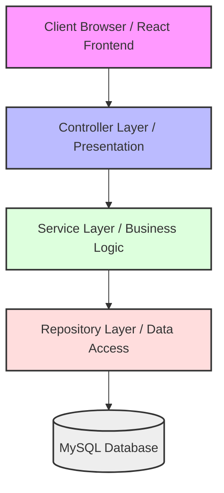

# SmartServ Project Design Patterns & Software Architecture

This document details the architectural and design patterns employed across the SmartServ application. The system follows a distributed **Client-Server Architecture** utilizing a **Spring Boot REST API** backend and a **React SPA (Vite)** frontend.

---

## 1. High-Level Architectural Patterns

### Layered Architecture (N-Tier)
The backend of SmartServ is structured using the traditional **Layered (N-Tier) Architecture**. It enforces a strict separation of concerns, ensuring that dependencies flow downwards:



*   **Presentation / Controller Layer**: Handles HTTP requests, parses JSON payloads, executes payload validation, and translates responses. Refer to:
    *   [UserController.java](file:///c:/Shivam%20New/PROJECT%202026/SmartServ/src/main/java/com/smartserv/controller/UserController.java)
    *   [AuthController.java](file:///c:/Shivam%20New/PROJECT%202026/SmartServ/src/main/java/com/smartserv/controller/AuthController.java)
*   **Business Logic / Service Layer**: Encapsulates core business actions, validations, transactions, and third-party API integrations (e.g., Razorpay). Refer to:
    *   [InvoiceServiceImpl.java](file:///c:/Shivam%20New/PROJECT%202026/SmartServ/src/main/java/com/smartserv/service/InvoiceServiceImpl.java)
    *   [JobCardServiceImpl.java](file:///c:/Shivam%20New/PROJECT%202026/SmartServ/src/main/java/com/smartserv/service/JobCardServiceImpl.java)
*   **Data Access / Repository Layer**: Interfaces directly with the database using Spring Data JPA, executing JPQL or native SQL queries. Refer to:
    *   [JobCardRepository.java](file:///c:/Shivam%20New/PROJECT%202026/SmartServ/src/main/java/com/smartserv/repository/JobCardRepository.java)
*   **Domain / Entity Layer**: Represents the database schema maps. Refer to:
    *   [JobCard.java](file:///c:/Shivam%20New/PROJECT%202026/SmartServ/src/main/java/com/smartserv/entity/JobCard.java)

### Stateless RESTful Architecture
The API represents resources via URI endpoints and uses standard HTTP verbs (`GET`, `POST`, `PUT`, `DELETE`). Session state is not stored on the server; instead, clients authenticate via a stateless JWT token sent in HttpOnly cookies or Authorization headers. This pattern allows the server tier to scale out horizontally.

---

## 2. Creational Design Patterns

### Singleton Pattern
The **Singleton Pattern** ensures that a class has only one instance and provides a global point of access to it.
*   **Implementation**: In Spring Boot, all Beans (Controllers, Services, Repositories, and Configurations) are instantiated as singletons by default inside the Spring Application Context.
*   **Rationale**: Statless helper objects do not hold mutable instance variables. Having a single shared instance minimizes resource usage and garbage collection overhead.

### Factory / Bean Configuration Pattern
The configuration classes define `@Bean` annotated methods which act as Factory Methods.
*   **Implementation**: In [RazorpayConfig.java](file:///c:/Shivam%20New/PROJECT%202026/SmartServ/src/main/java/com/smartserv/config/RazorpayConfig.java#L21-L24):
    ```java
    @Bean
    public RazorpayClient razorpayClient() throws RazorpayException {
        return new RazorpayClient(keyId, keySecret);
    }
    ```
*   **Rationale**: The developer delegates instance creation logic (and key binding) of third-party SDK clients to Spring's container so they can be injected as beans.

### Builder Pattern
The **Builder Pattern** provides a flexible solution to various object-creation problems in object-oriented programming. It simplifies constructing complex objects step-by-step.
*   **Implementation**: Used via Lombok's `@Builder` annotation on Data Transfer Objects, such as [InvoiceResponseDto.java](file:///c:/Shivam%20New/PROJECT%202026/SmartServ/src/main/java/com/smartserv/dto/invoice/InvoiceResponseDto.java#L11-L13):
    ```java
    @Data
    @Builder
    public class InvoiceResponseDto { ... }
    ```
    This allows constructing the DTO fluently inside [InvoiceServiceImpl.java](file:///c:/Shivam%20New/PROJECT%202026/SmartServ/src/main/java/com/smartserv/service/InvoiceServiceImpl.java#L196-L200):
    ```java
    return CreatePaymentOrderResponseDto.builder()
            .orderId(orderId)
            .invoiceId(invoice.getId())
            .invoiceNumber(invoice.getInvoiceNumber())
            .amount(invoice.getTotalAmount())
            .build();
    ```

---

## 3. Structural Design Patterns

### Proxy / Decorator Pattern
A **Proxy** controls access to another object by acting as a placeholder or wrapper. Spring framework utilizes proxies extensively under the hood to implement cross-cutting concerns (Aspect-Oriented Programming).
*   **Implementation**: Look at the `@Transactional` annotation on [InvoiceServiceImpl.java](file:///c:/Shivam%20New/PROJECT%202026/SmartServ/src/main/java/com/smartserv/service/InvoiceServiceImpl.java#L45):
    ```java
    @Service
    @Transactional
    public class InvoiceServiceImpl implements InvoiceService { ... }
    ```
*   **How it Works**: Spring generates a JDK Dynamic Proxy or CGLIB proxy around the `InvoiceServiceImpl` bean. When a client calls a method, the proxy intercepts the invocation, initiates a database transaction, forwards the call to the actual service method, and then commits or rolls back the transaction depending on whether exceptions occur.

```
[Client Call] ---> [Spring Transaction Proxy]
                          | (starts transaction)
                          v
                   [InvoiceServiceImpl (Actual Bean)]
                          |
                          v (executes logic / repository queries)
[Client Return] <-- [Spring Transaction Proxy (commits/rolls back)]
```

### Adapter Pattern / Data Mapper
The **Adapter Pattern** allows incompatible interfaces to work together. DTOs adapt database-centric JPA entities to clean, frontend-digestible data interfaces.
*   **Implementation**: The `ModelMapper` library configured in [pom.xml](file:///c:/Shivam%20New/PROJECT%202026/SmartServ/pom.xml#L79-L83) maps complex entities to light DTOs.
*   **Frontend Adapter**: In [invoiceService.js](file:///c:/Shivam%20New/PROJECT%202026/SmartServ/SmartServFrontEnd/src/services/invoiceService.js#L3-L16), the function `normalizeInvoice` adapts raw backend properties (resolving null safety and fallbacks) to structural formats expected by React UI components:
    ```javascript
    const normalizeInvoice = (inv) => {
      if (!inv) return inv;
      const base = Number(inv.baseAmount || 0);
      const tax = Number(inv.taxAmount || 0);
      const total = inv.totalAmount || (base + tax);
      return {
        ...inv,
        totalAmount: total,
        customerName: inv.customerName || inv.customer?.userName || 'Customer'
      };
    };
    ```

### Chain of Responsibility / Security Filter Chain
The **Chain of Responsibility** handles a request through a series of processing handlers (filters).
*   **Implementation**: Configured in [SecurityConfig.java](file:///c:/Shivam%20New/PROJECT%202026/SmartServ/src/main/java/com/smartserv/config/SecurityConfig.java#L37-L51):
    ```java
    http
        .csrf(csrf -> csrf.disable())
        .cors(Customizer.withDefaults())
        .sessionManagement(session -> session.sessionCreationPolicy(SessionCreationPolicy.STATELESS))
        .authorizeHttpRequests(auth -> auth
            .requestMatchers("/api/auth/**").permitAll()
            .anyRequest().authenticated()
        )
        .addFilterBefore(jwtAuthFilter, UsernamePasswordAuthenticationFilter.class);
    ```
*   **How it Works**: An HTTP request flows sequentially through the web server's filter pipeline. The custom interceptor `jwtAuthFilter` processes authentication tokens and decides whether to write credentials to the security context or pass the request along to downstream handlers.

---

## 4. Behavioral Design Patterns

### Dependency Injection (Inversion of Control)
Instead of classes instantiating their own dependencies, dependencies are provided externally.
*   **Implementation**: Handled using **Constructor-based Dependency Injection** aided by Lombok's `@RequiredArgsConstructor` (which automatically generates constructors for all `final` class fields). Look at [InvoiceServiceImpl.java](file:///c:/Shivam%20New/PROJECT%202026/SmartServ/src/main/java/com/smartserv/service/InvoiceServiceImpl.java#L46-L53):
    ```java
    @Service
    @RequiredArgsConstructor
    public class InvoiceServiceImpl implements InvoiceService {
        private final InvoiceRepository invoiceRepo;
        private final JobCardRepository jobCardRepo;
        private final RazorpayClient razorpayClient;
        // Spring automatically injects these registered beans when constructor is executed
    }
    ```

### Interceptor / Filter Pattern
The **Filter Pattern** dynamically intercepts incoming requests and outgoing responses.
*   **Implementation**: [JwtAuthFilter.java](file:///c:/Shivam%20New/PROJECT%202026/SmartServ/src/main/java/com/smartserv/security/JwtAuthFilter.java#L23) extends `OncePerRequestFilter`:
    ```java
    public class JwtAuthFilter extends OncePerRequestFilter {
        @Override
        protected void doFilterInternal(HttpServletRequest request, ...) {
            // Extracts JWT, validates it, populates SecurityContextHolder
            filterChain.doFilter(request, response);
        }
    }
    ```

### Strategy Pattern
The **Strategy Pattern** defines a family of algorithms, encapsulates each one, and makes them interchangeable.
*   **Implementation**: The `PasswordEncoder` interface in Spring Security. In [SecurityConfig.java](file:///c:/Shivam%20New/PROJECT%202026/SmartServ/src/main/java/com/smartserv/config/SecurityConfig.java#L53-L56), the cryptographic strategy is defined as `BCryptPasswordEncoder`:
    ```java
    @Bean
    public BCryptPasswordEncoder passwordEncoder() {
        return new BCryptPasswordEncoder();
    }
    ```
    Any service class executing registration or auth calls delegates hashing to the interface `PasswordEncoder`, allowing the underlying hashing strategy to change transparently.

### Observer / Publish-Subscribe Pattern
The **Observer Pattern** defines a provider-subscriber relationship where changes in state trigger event notifications to listeners.
*   **Implementation**: In [axiosConfig.js](file:///c:/Shivam%20New/PROJECT%202026/SmartServ/SmartServFrontEnd/src/api/axiosConfig.js#L23-L39), if the response interceptor catches a `401 Unauthorized` error, it broadcasts an event:
    ```javascript
    if (status === 401 || status === 403) {
      window.dispatchEvent(new Event('auth:unauthorized'));
    }
    ```
    This event is observed in the React Auth Provider inside [AuthContext.jsx](file:///c:/Shivam%20New/PROJECT%202026/SmartServ/SmartServFrontEnd/src/context/AuthContext.jsx#L47-L52):
    ```javascript
    useEffect(() => {
      const handleUnauthorized = () => logout();
      window.addEventListener('auth:unauthorized', handleUnauthorized);
      return () => window.removeEventListener('auth:unauthorized', handleUnauthorized);
    }, []);
    ```
*   **Benefit**: Decouples the low-level Axios client instance from React Context lifecycle hooks.

---

## 5. Persistence Patterns (JPA / Hibernate)

### Repository / Data Access Object (DAO) Pattern
The **Repository Pattern** provides a collection-like interface to access domain objects, decoupling the service layer from SQL querying specifics.
*   **Implementation**: Spring Data JPA repositories extend `JpaRepository`. Refer to:
    *   [JobCardRepository.java](file:///c:/Shivam%20New/PROJECT%202026/SmartServ/src/main/java/com/smartserv/repository/JobCardRepository.java)
*   **How it Works**: Spring Data dynamically generates proxy implementations of interfaces at startup, interpreting method signatures (e.g., `findByJobCardStatus`) directly into executed SQL statements.

### Query Fetch Optimization Pattern (Entity Graph / Fetch Joins)
By default, lazy loading associations can trigger the **N+1 Select Query Problem** (where loading N parent objects executes 1 select query for parents + N individual select queries to load child dependencies on-demand). SmartServ prevents this utilizing two performance optimizations:
1.  **Named Entity Graph Pattern**: Configured directly on entities using `@NamedEntityGraph` (e.g., [JobCard.java](file:///c:/Shivam%20New/PROJECT%202026/SmartServ/src/main/java/com/smartserv/entity/JobCard.java#L28-L50)):
    ```java
    @NamedEntityGraph(
        name = "JobCard.deep",
        attributeNodes = {
            @NamedAttributeNode(value = "manager"),
            @NamedAttributeNode(value = "mechanic"),
            @NamedAttributeNode(value = "items"),
            @NamedAttributeNode(value = "appointment", subgraph = "appointment-subgraph")
        }, ...
    )
    ```
2.  **Fetch Join Pattern**: Explicitly fetching dependencies using JPQL `LEFT JOIN FETCH` keywords inside query methods (e.g., [JobCardRepository.java](file:///c:/Shivam%20New/PROJECT%202026/SmartServ/src/main/java/com/smartserv/repository/JobCardRepository.java#L18-L25)):
    ```java
    @Query("SELECT DISTINCT j FROM JobCard j " +
           "LEFT JOIN FETCH j.appointment a " +
           "LEFT JOIN FETCH j.items")
    List<JobCard> findAll();
    ```

---

## 6. Frontend React Patterns

### Provider Pattern
The **Provider Pattern** is used to pass state from a parent component down to nested components implicitly, avoiding manual prop-drilling.
*   **Implementation**: Found in `src/context/` via [AuthContext.jsx](file:///c:/Shivam%20New/PROJECT%202026/SmartServ/SmartServFrontEnd/src/context/AuthContext.jsx#L108-L113):
    ```javascript
    return (
      <AuthContext.Provider value={value}>
        {!loading && children}
      </AuthContext.Provider>
    );
    ```
*   **Hook Adapter**: Wrapped inside a custom hook in [AuthContext.jsx](file:///c:/Shivam%20New/PROJECT%202026/SmartServ/SmartServFrontEnd/src/context/AuthContext.jsx#L7):
    ```javascript
    export const useAuth = () => useContext(AuthContext);
    ```

### Layout / Outlets Pattern
A design pattern where shared visual structures (headers, sidebars) wrap variable internal subviews.
*   **Implementation**: Configured in [AuthLayout.jsx](file:///c:/Shivam%20New/PROJECT%202026/SmartServ/SmartServFrontEnd/src/layouts/AuthLayout.jsx#L15):
    ```javascript
    const AuthLayout = () => {
      return (
        <div className="bg-light ...">
          <Card className="p-4 shadow-sm ...">
            <Outlet /> {/* React Router matches and renders children here */}
          </Card>
        </div>
      );
    };
    ```

### Service Module / Facade Pattern
Encapsulates API fetch scripts, payload structures, and response serialization away from the view lifecycle.
*   **Implementation**: Defined in `src/services/` (e.g., [invoiceService.js](file:///c:/Shivam%20New/PROJECT%202026/SmartServ/SmartServFrontEnd/src/services/invoiceService.js#L18)):
    ```javascript
    export const invoiceService = {
      generate: async (jobCardId) => { ... },
      getById: async (id) => { ... },
      verifyPayment: async (id, payload) => { ... }
    };
    ```
    This allows page components to fetch datasets asynchronously without managing base endpoints, interceptors, or mapping functions directly.

---

## Summary Matrix of Design Patterns

| Pattern Category | Pattern Name | Key Java / JS Code Reference | Primary Benefit |
| :--- | :--- | :--- | :--- |
| **Architectural** | N-Tier Layered | Controllers -> Services -> Repositories | Separation of concerns, cleaner maintenance. |
| **Architectural** | Stateless REST | [SecurityConfig.java](file:///c:/Shivam%20New/PROJECT%202026/SmartServ/src/main/java/com/smartserv/config/SecurityConfig.java) | Scalable backend execution. |
| **Creational** | Singleton | All `@Component` / `@Service` Beans | Memory footprint minimization. |
| **Creational** | Factory / Bean | [RazorpayConfig.java](file:///c:/Shivam%20New/PROJECT%202026/SmartServ/src/main/java/com/smartserv/config/RazorpayConfig.java) | Configured third-party object injection. |
| **Creational** | Builder | [InvoiceResponseDto.java](file:///c:/Shivam%20New/PROJECT%202026/SmartServ/src/main/java/com/smartserv/dto/invoice/InvoiceResponseDto.java) | Clear step-by-step object construction. |
| **Structural** | Proxy (AOP) | `@Transactional` in Services | Declarative database transaction boundary management. |
| **Structural** | Adapter / Mapper | `ModelMapper` / `normalizeInvoice()` | Entity to DTO translation. Decouples API from DB. |
| **Structural** | Chain of Responsibility | `SecurityFilterChain` / [SecurityConfig.java](file:///c:/Shivam%20New/PROJECT%202026/SmartServ/src/main/java/com/smartserv/config/SecurityConfig.java) | Pipeline request handling and authentication filters. |
| **Behavioral** | Dependency Injection | Constructor Injection / `@RequiredArgsConstructor` | Inversion of Control, testability. |
| **Behavioral** | Interceptor | [JwtAuthFilter.java](file:///c:/Shivam%20New/PROJECT%202026/SmartServ/src/main/java/com/smartserv/security/JwtAuthFilter.java) & [axiosConfig.js](file:///c:/Shivam%20New/PROJECT%202026/SmartServ/SmartServFrontEnd/src/api/axiosConfig.js) | Decoupled pre-processing and post-processing of payloads. |
| **Behavioral** | Strategy | `PasswordEncoder` / [SecurityConfig.java](file:///c:/Shivam%20New/PROJECT%202026/SmartServ/src/main/java/com/smartserv/config/SecurityConfig.java) | Hashing algorithm abstraction. |
| **Behavioral** | Observer (Pub-Sub) | `window.dispatchEvent` / `addEventListener` | Decoupled authorization event handling on the frontend. |
| **Persistence** | Repository (DAO) | [JobCardRepository.java](file:///c:/Shivam%20New/PROJECT%202026/SmartServ/src/main/java/com/smartserv/repository/JobCardRepository.java) | High-level data collection access. |
| **Persistence** | Fetch Optimization | `@NamedEntityGraph` & `LEFT JOIN FETCH` | Eliminates N+1 query performance bottleneck. |
| **Frontend UI** | Provider (Context) | [AuthContext.jsx](file:///c:/Shivam%20New/PROJECT%202026/SmartServ/SmartServFrontEnd/src/context/AuthContext.jsx) | Avoids prop-drilling across deep component trees. |
| **Frontend UI** | Layout (Outlets) | [AuthLayout.jsx](file:///c:/Shivam%20New/PROJECT%202026/SmartServ/SmartServFrontEnd/src/layouts/AuthLayout.jsx) | Shared routing frame wrappers. |
| **Frontend UI** | Service Module | `src/services/` API clients | Abstracted data fetching details. |

---

## Next Steps & Interview Preparation

To practice and prepare for technical interviews regarding these patterns, please refer to the comprehensive Q&A guide:
*   [Design Patterns Interview Q&A Guide](file:///c:/Shivam%20New/PROJECT%202026/SmartServ/docs/DESIGN_PATTERNS_QA.md)

