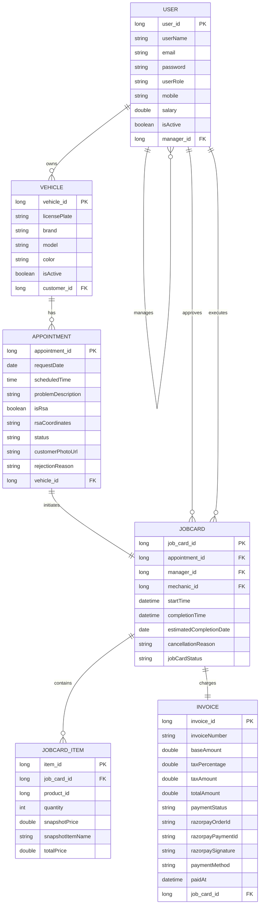
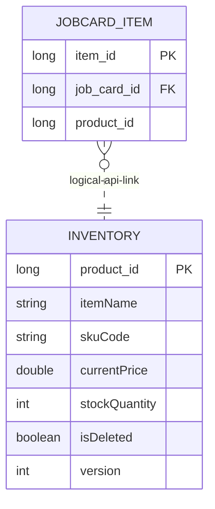

# SmartServ Entity-Relationship (ER) Architecture - Q&A Guide

This guide explains how our database tables and Java entities connect with each other, using simple English.

---

## Complete Database Entity-Relationship (ER) Diagram

Below is the visual database schema of the SmartServ Core Application (Note: The `Inventory` entity is excluded here as it resides in the decoupled `smartserv_inventory` microservice database, linked logically by product IDs).

### Text-Based Relationship Map

```text
  +----------------------------------+          +----------------------------------+
  |             USER (1)             |<---------|           VEHICLE (N)            |
  |  - user_id (PK)                  |  (owns)  |  - vehicle_id (PK)               |
  |  - manager_id (FK -> self) (N)   |          |  - customer_id (FK -> USER) (1)  |
  +----------------------------------+          +----------------------------------+
        ^                      ^                                  ^
        |                      |                                  |
        | (manager_id) (1:N)   | (mechanic_id) (1:N)              | (vehicle_id) (1:N)
        |                      |                                  | (has)
        |                      |                        +------------------------+
        |                      |                        |    APPOINTMENT (N)     |
        |                      |                        |  - appointment_id (PK) |
        |                      |                        |  - vehicle_id (FK) (1) |
        |                      |                        +------------------------+
        |                      |                                  ^
        |                      |                                  | (1)
        |                      |                                  | (initiates 1:1)
        |                      |                                  |
        |                      +------------------------+         | (1)
        |                                               |         |
        +-----------------------------------------+     |         |
                                                  |     |         |
                                                  |     |         |
                                            +----------------------------------+
                                            |           JOBCARD (N)            |
                                            |  - job_card_id (PK)              |
                                            |  - appointment_id (FK - 1:1) (1) |
                                            |  - manager_id (FK) (1)           |
                                            |  - mechanic_id (FK) (1)          |
                                            +----------------------------------+
                                                  ^                      ^
                                                  |                      |
                                                  | (contains 1:N)       | (charges 1:1)
                                                  |                      |
                                            +------------------------+ +------------------------+
                                            |    JOBCARD_ITEM (N)    | |      INVOICE (1)       |
                                            |  - item_id (PK)        | |  - invoice_id (PK)     |
                                            |  - job_card_id (FK) (1)| |  - job_card_id (FK)(1) |
                                            |  - product_id (Logical)| +------------------------+
                                            +------------------------+
```

### Mermaid Diagram Script



---

## Decoupled Inventory Database Schema & Logical ER Mapping

Below is the database schema for the **Inventory Service** and how it links logically to the **Core Service** database:

### Decoupled Logical Relationship Map (Text-Based)

```text
  +--------------------------------------------+
  |              INVENTORY DB                  |
  |                                            |
  |  +--------------------------------------+  |
  |  |            INVENTORY (1)             |  |
  |  |  - product_id (PK)                   |  |
  |  |  - item_name                         |  |
  |  |  - sku_code                          |  |
  |  |  - current_price                     |  |
  |  |  - stock_quantity                    |  |
  |  |  - is_deleted                        |  |
  |  |  - version (Optimistic Lock Version) |  |
  |  +--------------------------------------+  |
  +--------------------------------------------+
                        ^
                        |
                        | Logical link via HTTP/REST API calls
                        | (Resolves 1:N cardinality)
                        |
  +--------------------------------------------+
  |                CORE DB                     |
  |                                            |
  |  +--------------------------------------+  |
  |  |          JOBCARD_ITEM (N)            |  |
  |  |  - item_id (PK)                      |  |
  |  |  - job_card_id (FK) (1)              |  |
  |  |  - product_id (Logical FK) (1)       |  |
  |  +--------------------------------------+  |
  +--------------------------------------------+
```

### Decoupled Logical Relationship Diagram (Mermaid)



---

## 1. Core Domain Flow & Mappings

### Q1: What does "Entity-Relationship" (ER) mean?
* **Entity**: A real-world thing or object that we want to store in our database (represented as a Java class with the `@Entity` annotation). Examples: `User`, `Vehicle`, `JobCard`.
* **Relationship**: How these entities connect to each other. For example, a **Vehicle** is linked to a **User** who owns it.
* **Attributes**: The information stored inside each entity. For example, a **User** has a *userName*, *email*, and *password*.

---

### Q2: What is the "Lifecycle Story" of how our tables connect?
To understand the database, imagine a customer visiting the auto repair shop:

1. A **User** (Customer) registers an account.
2. A **Vehicle** is registered. It has a unidirectional `@ManyToOne` link pointing to the **User** (Customer) who owns it.
3. The customer books an **Appointment** for their vehicle. The Appointment has a `@ManyToOne` link pointing to the **Vehicle**.
4. A manager approves the Appointment and creates a **JobCard** to track the work. The JobCard has a `@OneToOne` link pointing back to the **Appointment**.
5. The mechanic adds **JobCardItems** (parts like oil filters or spark plugs). The JobCard has a `@OneToMany` list of these items, and each item links back to the JobCard.
6. Once the work is done, an **Invoice** is generated. The Invoice has a `@OneToOne` link pointing back to the **JobCard**.

---

### Q3: What is a "Unidirectional Many-to-One" relationship?
* **Simple Answer**: It means Table B has a column pointing to Table A, but Table A has no idea Table B exists in its Java class definition.
* **Example**: **Vehicle** and **User**.
  * Multiple cars (Vehicles) can point to the same owner (User) using a `customer_id` foreign key.
  * In [Vehicle.java](../core-service/src/main/java/com/smartserv/entity/Vehicle.java), we write `@ManyToOne` pointing to the customer.
  * But in [User.java](../core-service/src/main/java/com/smartserv/entity/User.java), we do **not** define a `@OneToMany` list of vehicles. This keeps the `User` class simple and clean.

---

### Q4: What is a "Self-Referencing" relationship?
* **Simple Answer**: It means a table has a foreign key column that points back to itself.
* **Example**: **User** (Employees and Managers).
  * Employees (Mechanics, Managers) and the Admin are all stored in the same `users` table.
  * To track who reports to whom, [User.java](../core-service/src/main/java/com/smartserv/entity/User.java) has a `@ManyToOne` field called `manager` that points to another `User` record inside the same table:
    ```java
    @ManyToOne(fetch = FetchType.LAZY)
    @JoinColumn(name="manager_id")
    private User manager;
    ```
  * In SQL, this creates a `manager_id` foreign key pointing back to `user_id` inside the `users` table.

---

### Q5: What is a "One-to-One" (1:1) relationship?
* **Simple Answer**: It means **one** record in Table A connects to **exactly one** record in Table B.
* **Example**: **Invoice** and **JobCard**.
  * Each Invoice belongs to exactly one JobCard.
  * In [Invoice.java](../core-service/src/main/java/com/smartserv/entity/Invoice.java), we define:
    ```java
    @OneToOne(fetch = FetchType.LAZY)
    @JoinColumn(name="job_card_id", nullable=false, unique = true)
    private JobCard jobCard;
    ```
  * The `unique = true` constraint ensures that no two invoices can point to the same JobCard.

---

### Q6: Why did we remove the physical database link between JobCardItem and Inventory?
In our monolithic database design, `job_card_item` had a physical foreign key constraint pointing to the `inventory` table.
* **Why we removed it**: We migrated to a **Microservices Architecture**. The Inventory table was moved to a completely separate database (`smartserv_inventory`) managed by the **Inventory Service**.
* **The New Link**: We replaced the physical `@ManyToOne` mapping in [JobCardItem.java](../core-service/src/main/java/com/smartserv/entity/JobCardItem.java) with a simple long column:
  ```java
  @Column(name="product_id", nullable=false)
  private Long inventoryItemId;
  ```
  This is a **logical link**. The database no longer checks if the ID exists automatically; instead, our Java code queries the Inventory Service via OpenFeign to validate it.

---

## 2. Advanced JPA Concepts & Enums

### Q7: What is "Lazy Loading" vs "Eager Loading"?
When we load a JobCard from the database, do we also load all its associated entities (like the manager, mechanic, and items list) immediately?
* **Eager Loading** (`FetchType.EAGER`): Loads everything at once. If you fetch a JobCard, the database automatically runs SQL joins to fetch every related record.
  * *Downside*: It wastes computer memory and slows down query speed if you only wanted to check the status of the job card.
* **Lazy Loading** (`FetchType.LAZY` - Our Default): Only loads the basic JobCard data. It will only query the database for the items list or user details when your Java code explicitly calls `jobCard.getItems()` or `jobCard.getManager()`.
  * *Benefit*: Highly optimized database performance. We only fetch what we ask for.

---

### Q8: What is "Cascading" (`cascade = CascadeType.ALL`)?
Cascading defines what happens to child records when a parent record is modified or deleted.
* **Example**: **JobCard** and **JobCardItem**.
  * A JobCard contains a list of JobCardItems.
  * In [JobCard.java](../core-service/src/main/java/com/smartserv/entity/JobCard.java), we specify `cascade = CascadeType.ALL` and `orphanRemoval = true` on the `@OneToMany` mapping.
* **What this means**:
  * **Cascade Save**: Saving a new JobCard automatically saves all the items added to its list.
  * **Cascade Delete**: Deleting a JobCard automatically deletes all its items from the database so we don't leave "orphan" rows behind.

---

### Q9: How do we handle deletions of critical entities? (Soft Deletes)
If a manager deletes an old product (like a deprecated oil filter), we cannot physically run `DELETE FROM inventory`. If we did, past Job Cards referencing that item's ID would throw database exceptions or display blank fields!
* **Our Solution**: We use **Soft Deletes** (a boolean flag `is_deleted`).
* When an item is deleted, we run:
  ```sql
  UPDATE inventory SET is_deleted = true WHERE product_id = ?;
  ```
* All search and selection APIs only return rows where `is_deleted = false`.
* Old job cards can still look up the historical item details by ID, keeping our database history intact.

---

### Q10: What is the `BaseEntity` class and why do all entities inherit from it?
Instead of defining primary keys (`id`) and audit columns (`created_on`, `updated_on`) in every class, we put them in a single class called [BaseEntity.java](../core-service/src/main/java/com/smartserv/entity/BaseEntity.java).
* **`@MappedSuperclass`**: Tells JPA that this class is not a database table itself, but its columns should be added to any subclass table (like `User`, `Vehicle`).
* **Audit Columns**:
  * `@CreationTimestamp`: Automatically writes the date and time when the row is first created.
  * `@UpdateTimestamp`: Automatically updates the date and time whenever the row is modified.
* **Primary Key generation**: We use `GenerationType.IDENTITY`, which tells MySQL to handle auto-incrementing the ID column (`1, 2, 3...`) automatically.

---

### Q11: How do Enums work in our database?
Java uses Enums to represent fixed choices (like role types). In our database, we save these enums as text strings using `@Enumerated(EnumType.STRING)`.
* **Why use STRING instead of ORDINAL?** 
  * If we use default Ordinal numbers, `MANAGER` might be saved as `0`, `MECHANIC` as `1`. If we add a new role at the top later, all old numbers shift, causing data corruption!
  * Saving as strings (e.g., `"CUSTOMER"`) keeps the database clear and future-proof.
* **Our Enums**:
  * `Role`: `CUSTOMER`, `MECHANIC`, `MANAGER` (defines authorization).
  * `Status` (Appointments): `PENDING`, `APPROVED`, `REJECTED`, `CANCELLED`.
  * `JobCardStatus`: `PENDING`, `IN_PROGRESS`, `COMPLETED`, `CANCELLED`.
  * `PaymentStatus`: `PENDING`, `PAID`, `FAILED`.
  * `PaymentMethod`: `CASH`, `ONLINE`.

---

## 3. Entity-by-Entity Relationships

### Q12: How are Appointments linked to Vehicles and Customers?
* **Relationships**:
  * An [Appointment.java](../core-service/src/main/java/com/smartserv/entity/Appointment.java) has a `@ManyToOne` relationship to a **Vehicle**.
  * A [Vehicle.java](../core-service/src/main/java/com/smartserv/entity/Vehicle.java) has a `@ManyToOne` relationship to a **User** (Customer).
* **Database Normalization**: To find out who booked an appointment, the system navigates through the vehicle: `Appointment -> Vehicle -> Customer (User)`. We do not link Appointment directly to Customer to avoid redundant columns.

---

### Q13: How does the relationship between JobCard, Manager, and Mechanic work?
A JobCard needs to track both who created it (Manager) and who is doing the work (Mechanic).
* **Implementation**: In [JobCard.java](../core-service/src/main/java/com/smartserv/entity/JobCard.java), we define two separate `@ManyToOne` fields pointing to the `User` entity:
  ```java
  @ManyToOne(fetch = FetchType.LAZY)
  @JoinColumn(name = "manager_id", nullable = false)
  private User manager;

  @ManyToOne(fetch = FetchType.LAZY)
  @JoinColumn(name = "mechanic_id")
  private User mechanic;
  ```
* **SQL translation**: This creates two foreign key columns (`manager_id` and `mechanic_id`) in the `job_card` table, both linking to the `user_id` column in the `users` table. `mechanic_id` can be null initially until a mechanic is assigned.

---

### Q14: Explain the bidirectional relationship between JobCard and JobCardItem.
* **Implementation**:
  * In [JobCard.java](../core-service/src/main/java/com/smartserv/entity/JobCard.java) (Parent):
    ```java
    @OneToMany(mappedBy = "jobCard", cascade = CascadeType.ALL, orphanRemoval = true)
    private List<JobCardItem> items = new ArrayList<>();
    ```
  * In [JobCardItem.java](../core-service/src/main/java/com/smartserv/entity/JobCardItem.java) (Child):
    ```java
    @ManyToOne(fetch = FetchType.LAZY)
    @JoinColumn(name="job_card_id", nullable=false)
    private JobCard jobCard;
    ```
* **Who owns the relationship?** The child `JobCardItem` owns it because it holds the physical `job_card_id` column. The `mappedBy = "jobCard"` property on the parent tells Hibernate to look at the child's `jobCard` property to find the mapping, rather than creating a separate mapping table.
* **Why the database has no `job_card_item_id` in `job_card`**:
  * In a relational database, you cannot store a list of IDs in a single cell (e.g., you can't put `[1, 2, 3]` inside a single `job_card` column). This is a rule of database design (First Normal Form).
  * Therefore, the physical database foreign key (`job_card_id`) lives **only** in the child table: `job_card_item`.
* **How Hibernate does the magic**:
  * Because of `mappedBy = "jobCard"`, Hibernate knows that the child table owns the foreign key.
  * When your Java code calls `jobCard.getItems()`, Hibernate automatically runs a background SQL query to find all items:
    ```sql
    SELECT * FROM job_card_item WHERE job_card_id = ?;
    ```
  * It then takes those database rows and injects them into the Java list. This is how it achieves a **two-way (bidirectional) link** in Java, using only **one column** in the database!

---

### Q15: Why is the Invoice `@OneToOne` join column on the Invoice side and not the JobCard side?
* In [Invoice.java](../core-service/src/main/java/com/smartserv/entity/Invoice.java), we have:
  ```java
  @OneToOne(fetch = FetchType.LAZY)
  @JoinColumn(name="job_card_id", nullable=false, unique = true)
  private JobCard jobCard;
  ```
* **Why this makes sense**: In the system lifecycle, a JobCard is created first, and stays active for hours or days. The Invoice is generated only at the very end when work is completed. Placing the foreign key column `job_card_id` in the `invoice` table ensures we don't pollute the `job_card` table with invoice columns while work is in progress.

---

### Q16: How do we track Razorpay online payment transaction details?
Our [Invoice.java](../core-service/src/main/java/com/smartserv/entity/Invoice.java) entity contains three columns for Razorpay transaction details:
* `razorpay_order_id`: The ID of the order generated by Razorpay.
* `razorpay_payment_id`: The transaction receipt ID returned by Razorpay after successful payment.
* `razorpay_signature`: The security hash sent by Razorpay to verify the payment is genuine.
* These fields connect our database invoice status directly with the payment gateway verification system.

---

### Q17: What does `@NamedEntityGraph` do in JobCard and why do we use it?
By default, all our relationships are `LAZY`. If we want to show a manager dashboard with 10 JobCards (including customer name, license plate, mechanic, and items list), Hibernate would execute one query for the JobCards and then dozens of individual queries to load the lazy relationships (the **N+1 query problem**).
* **Our Solution**: In [JobCard.java](../core-service/src/main/java/com/smartserv/entity/JobCard.java), we define a `@NamedEntityGraph` called `JobCard.deep`.
* This graph instructs Hibernate: *"When querying JobCards using this graph, generate a single query with SQL LEFT JOINS to load the manager, mechanic, items, appointment, vehicle, and customer details all at once."*
* This reduces database network roundtrips from 50+ to exactly 1.

---

### Q18: What is Road Side Assistance (RSA) in Appointments, and how are coordinates stored?
* **RSA Flag**: [Appointment.java](../core-service/src/main/java/com/smartserv/entity/Appointment.java) has a boolean column `is_rsa` to track if the vehicle broke down on the road and needs a towing truck or mobile mechanic.
* **RSA Coordinates**: We store the latitude and longitude of the break-down location as a string (e.g., `"19.0760, 72.8777"`) in the `rsa_coordinates` column.
* This separates emergency roadside appointments from standard schedule-based workshop appointments.
