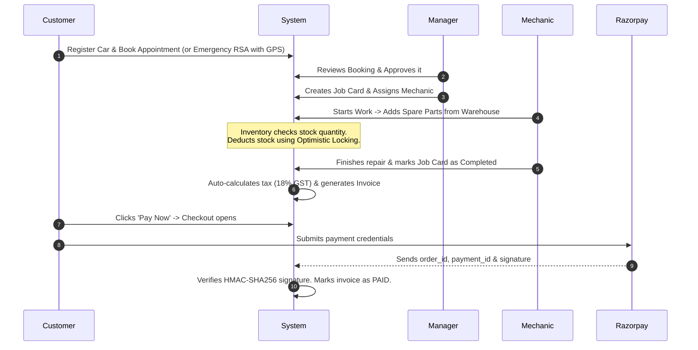

# Project Explanation Guide: "Tell Me About Your Project"
## SmartServ – Enterprise Automobile Service Management Platform

This guide helps you explain the SmartServ project in your technical interviews. It is written in **very simple English** and structured **professionally** so you can speak with confidence and clarity.

---

## 1. Quick Speech Scripts (Choose based on interview time)

### Option A: The 30-Second Elevator Pitch
*(Use this if the interviewer wants a very quick summary or if you are introducing yourself briefly.)*

> "My latest project is **SmartServ**, an enterprise-grade web platform for managing automobile workshops. It automates garage operations, including customer bookings, emergency roadside help with GPS, mechanic tracking, warehouse stock control, and secure online payments. 
> 
> On the frontend, we use **React 19** and **Vite**. On the backend, we built a **Spring Cloud microservice architecture** using **Spring Boot 3.5** and a **MySQL** database. I worked on building secure REST APIs, handling concurrent stock deductions, and optimizing database query performance."

---

### Option B: The 2-Minute Standard Answer
*(This is the most common and recommended answer to: "Tell me about your project".)*

> "I worked on **SmartServ**, an enterprise platform designed to automate automobile workshops and garages. Before this, most garages used manual paper tracking, which led to lost bookings, slow repair updates, and wrong warehouse stock numbers.
> 
> SmartServ solves this by connecting all workshop users in one flow:
> 1. **Customers** can register their cars, book service slots, or request immediate emergency roadside assistance (RSA) using their GPS location.
> 2. **Managers** approve bookings and assign them to mechanics using digital **Job Cards**.
> 3. **Mechanics** view their assigned jobs, track their time, and add spare parts from the inventory to the Job Card.
> 4. **Billing** is automated. The system calculates taxes, generates invoices, and processes secure online payments using the **Razorpay** payment gateway.
> 
> **Technically, the system is split into:**
> * A frontend single-page application built with **React 19** and **Vite** for a fast and smooth user interface.
> * A backend **Spring Cloud microservices** system built with **Spring Boot 3.5** and **MySQL**.
> * We have an **API Gateway** to route requests and a **Eureka Discovery Server** so services can find and talk to each other.
> 
> Personally, my main responsibilities were designing the database tables, implementing stateless **JWT authentication**, handling concurrent inventory stock updates safely, and solving database performance bottlenecks."

---

### Option C: The 5-Minute Detailed Deep-Dive
*(Use this if the interviewer says: "Go into detail. Explain the architecture, challenges, and how it works under the hood".)*

> "I worked on **SmartServ**, an automobile service management platform. The goal of this project was to digitize workshop operations like bookings, repairs, warehouse inventory, and billing. 
> 
> ### The Architecture
> We designed the backend as a **Spring Cloud microservices architecture** to separate business domains and ensure we could scale them independently. 
> * We split our system into two main services: the **Core Service** (which handles users, bookings, job cards, and invoices) and the **Inventory Service** (which manages spare parts and catalog items).
> * The client browser talks to a single **API Gateway** running on port 8080. The Gateway handles authorization and routes requests to the correct service.
> * We use **Netflix Eureka** as a service registry so our microservices can find each other dynamically.
> * The services communicate with each other using **OpenFeign** clients, and we use a custom interceptor to pass the user's JWT security token along during inter-service calls.
> 
> ### The Database Setup
> To keep the microservices decoupled, we split the database. The Core Service connects to a database called `smartserv`, and the Inventory Service connects to a separate database called `smartserv_inventory`. 
> 
> Because we split the databases, we removed physical database foreign keys between our billing tables and our inventory tables. Instead, we use **logical references** (storing the product ID as a simple number) and retrieve details across the network when building the invoices.
> 
> ### Key Technical Challenges I Solved
> During development, we hit three major technical challenges:
> 
> 1. **Stock Contention (Race Conditions):** When multiple mechanics checked out the last available brake pad at the same millisecond, we faced double-selling and negative stock. I solved this by implementing **Optimistic Locking** using JPA's `@Version` annotation. The first transaction updates the database and increments the version; the second transaction fails because it detects a version mismatch. We roll back the failed transaction and show a clean error message.
> 
> 2. **Database Performance (The N+1 Query Problem):** When loading the manager's dashboard, Hibernate was firing over 100 SQL queries to load 20 job cards because of nested relationships (like Customer, Mechanic, Vehicle, and Items). I optimized this by implementing a **JPA `@NamedEntityGraph`**. This forced Hibernate to fetch all nested entities in a single SQL query using `LEFT OUTER JOIN`s, reducing our page load speed from 480 milliseconds to 45 milliseconds.
> 
> 3. **Payment Security:** We integrated **Razorpay** for billing. To prevent malicious users from hacking the frontend network calls to mark an unpaid invoice as 'PAID', we split payment into a two-step process. When a user pays, the backend receives a cryptographic signature. We recalculate this signature on the backend using an **HMAC-SHA256** hash and our secret API key. We only update the invoice to 'PAID' if the signatures match perfectly.
> 
> Overall, this project taught me a lot about distributed systems, transaction safety, and query optimization."

---

## 2. Business Flow Walkthrough (The Product Logic)

Understanding the business flow shows you care about the product, not just the code. Here is how data moves through SmartServ:

---

## 3. Microservices Architecture Explained (In Simple Terms)

If the interviewer asks: **"Why did you use these Spring Cloud components?"**, use these simple explanations:

*   **API Gateway (Port 8080):** 
    *   *What it is:* The single front door of our application.
    *   *Why we need it:* The React frontend doesn't need to know the IP addresses of all our microservices. It only calls port 8080. The Gateway automatically routes `/api/inventory/**` to the Inventory Service, and `/api/jobcard/**` to the Core Service.
*   **Eureka Discovery Server (Port 8761):**
    *   *What it is:* A phone book for our microservices.
    *   *Why we need it:* In the cloud, microservice instances can start and stop dynamically, changing their IP addresses. When they start, they register themselves with Eureka. If the Core Service needs to call the Inventory Service, it asks Eureka for the active IP address.
*   **OpenFeign (Inter-service Communication):**
    *   *What it is:* A tool that makes calling another service look like calling a local Java method.
    *   *Why we need it:* When a mechanic adds an item to a Job Card in the Core Service, the Core Service must ask the Inventory Service if that item is in stock. We use an OpenFeign interface to make a standard HTTP GET call (`GET /api/inventory/{id}`) in one line of code.
*   **Spring Boot Admin (Port 8083):**
    *   *What it is:* A monitoring dashboard.
    *   *Why we need it:* It collects CPU, memory, and performance data from all running microservices and shows them on a single, easy-to-read web page.

---

## 4. Explaining the 3 Hardest Technical Challenges Simply

When the interviewer asks: **"What was the most challenging part of this project?"**, talk about these three items. Use the simple, plain-English structures below:

### Challenge 1: Preventing Negative Warehouse Stock (Concurrency)
*   **The Problem:** Two mechanics simultaneously request the last available oil filter for two different cars. If both read the database at the same time, they both see `stock = 1`. Both update it to `stock = 0`. The workshop now has zero physical items, but has promised it to two different customers.
*   **The Solution:** 
    *   We added a `@Version` column to the `Inventory` table.
    *   When Mechanic A saves, the version goes from `5` to `6` in the database.
    *   When Mechanic B tries to save, the database checks: *"Is the version still 5?"* No, it is `6`. 
    *   The database rejects Mechanic B's save. JPA throws an `OptimisticLockException`. 
    *   We catch this exception, cancel Mechanic B's transaction automatically, and tell them to refresh their screen because the stock was updated by someone else.

### Challenge 2: The N+1 Database Query Problem (Performance)
*   **The Problem:** We have a dashboard showing 20 Job Cards. Each Job Card has relations: a Mechanic, a Manager, an Appointment, a Vehicle, and a Customer. By default, Hibernate uses Lazy Loading. This means it runs 1 SQL query to get the 20 Job Cards, and then runs separate SQL queries for *each* relation of *each* Job Card. That means `1 + 20 * 5 = 101` database queries just to load one page! This made the application slow (~480ms).
*   **The Solution:**
    *   We defined a `@NamedEntityGraph` on our `JobCard` entity. This graph defines exactly which child relations should be fetched immediately.
    *   In our Spring Repository, we added the `@EntityGraph` annotation to our finder method.
    *   Now, Hibernate generates a single, large SQL statement using `LEFT OUTER JOIN`s to load the Job Cards and their relations in one go. The database round-trips dropped to exactly 1, and the response time fell to **45ms**.
    *   *For a detailed Q&A explanation, analogies, and code snippets, see the [N1_QUERY_PROBLEM_EXPLAINED.md](N1_QUERY_PROBLEM_EXPLAINED.md) file.*

### Challenge 3: Payment Spoofing (Security)
*   **The Problem:** In a typical web app, a customer sees a payment gateway popup. Once they pay, the popup sends a "Success" message to the frontend. If the frontend directly calls the backend saying *"Payment was successful, mark invoice as paid"*, a hacker can intercept this network call and send a fake "Success" message without actually paying.
*   **The Solution:**
    *   We never trust frontend claims about money.
    *   When a payment succeeds, Razorpay generates a cryptographic signature using the `order_id` and the `payment_id`.
    *   The frontend sends these IDs and the signature to our backend.
    *   Our backend takes the `order_id` and `payment_id`, hashes them together using our secret API key (which is hidden on the server) via **HMAC-SHA256**, and checks if our calculated signature matches the signature from Razorpay.
    *   If they match, we mark the invoice as PAID. If they don't, we reject it. This mathematically guarantees that no one can fake a payment.
    *   *For a detailed Q&A explanation, flow diagram, and code snippets, see the [PAYMENT_VERIFICATION_EXPLAINED.md](PAYMENT_VERIFICATION_EXPLAINED.md) file.*

---

## 5. Architectural Decisions & Trade-offs (To defend your choices)

### Trade-off 1: Why MySQL instead of a NoSQL database (like MongoDB)?
*   **Answer:** *"We chose MySQL because our data is highly structured and relational. We have strict dependencies: an Invoice belongs to a Job Card, which belongs to an Appointment, which belongs to a Vehicle owned by a Customer. 
    More importantly, we deal with money (billing) and inventory. We need strict **ACID transactions** to ensure that if a payment verification fails, the inventory stock is rolled back and never lost. MongoDB is great for unstructured logs or scaling rapidly, but for transactions and invoicing, a relational database with foreign key consistency is the safest choice."*

### Trade-off 2: Why migrate from a Monolith to Microservices?
*   **Answer:** *"We started with a clean, modular monolith because it allowed us to build features quickly without network overhead or deployment complexity. However, as our inventory warehouse and booking transactions grew, we faced two bottlenecks:
    1. The inventory catalog was read constantly by mechanics and managers, locking databases and slowing down bookings.
    2. A crash in the booking module took down the entire billing and warehouse system.
    By splitting the **Inventory Service** into its own microservice with its own database, we isolated the resource consumption. Now, if the Core service has high traffic or goes down, the inventory warehouse can still be queried by suppliers independently."*

### Trade-off 3: JWT Storage (LocalStorage vs. HttpOnly Cookies)
*   **Answer:** *"Currently, we store our JWT token in `localStorage` and attach it to outgoing API requests using an Axios interceptor. This is simple and prevents CSRF (Cross-Site Request Forgery) attacks because browsers do not send LocalStorage tokens automatically. 
    However, we know that LocalStorage can be read by JavaScript, making it vulnerable to XSS (Cross-Site Scripting). For enterprise-level security, our roadmap includes migrating refresh tokens to **HttpOnly, Secure cookies** with `SameSite=Strict` and keeping short-lived access tokens strictly in memory."*

---

## 6. Glossary (Buzzwords explained in simple terms)

If you get stuck on a term, look at this simple glossary:

*   **REST API:** A way for a frontend app (React) to request data from a backend app (Spring Boot) using standard URLs and HTTP actions (GET, POST, PUT, DELETE).
*   **Stateless:** The server does not store session memory about who is logged in. Every incoming request must contain a credential token (JWT) to identify the user.
*   **JWT (JSON Web Token):** A secure, signed string containing user details (username, role) that acts like a digital ID badge.
*   **HMAC-SHA256:** A secure math formula that signs data using a private secret key. It proves that the data was not tampered with.
*   **Optimistic Locking:** A concurrency strategy that assumes conflicts are rare. It uses version numbers to detect if another user changed the data since it was read, throwing an exception if a conflict occurs.
*   **JPA N+1 Problem:** A performance bug where Hibernate executes N separate database queries to load child relationships for N records, instead of fetching them all in a single query.
*   **Soft Delete:** Hiding a record by setting a flag (e.g., `is_deleted = true`) instead of deleting it permanently with SQL `DELETE`. This keeps history safe for audits.
*   **Spring Boot Actuator:** A tool built into Spring Boot that outputs health status, CPU usage, and memory metrics of the running application.
