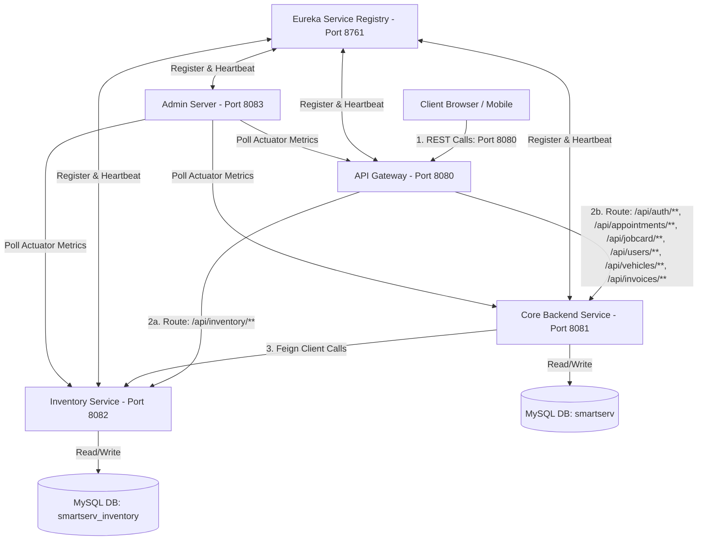
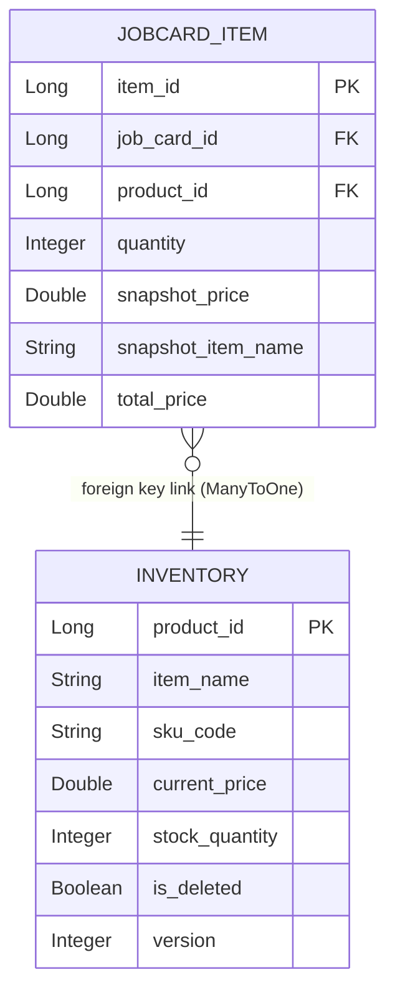
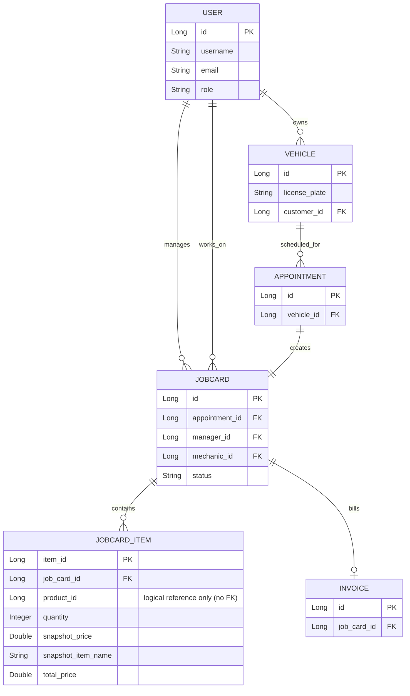
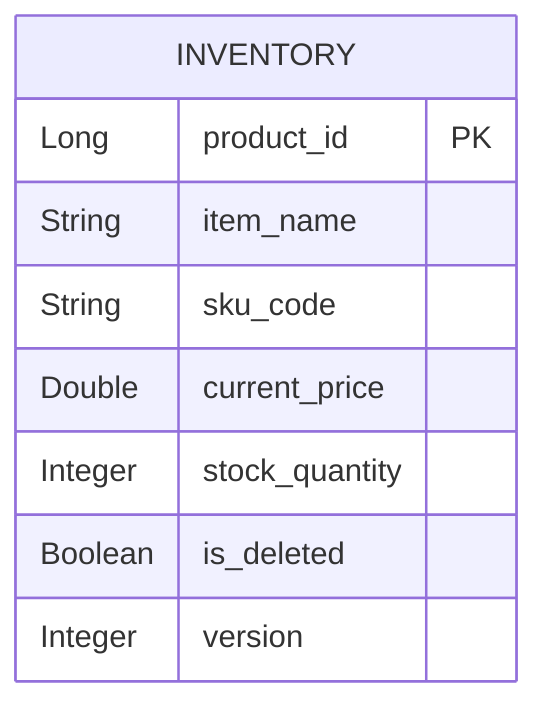
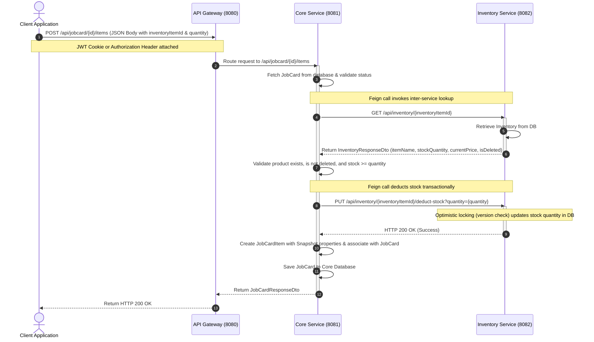
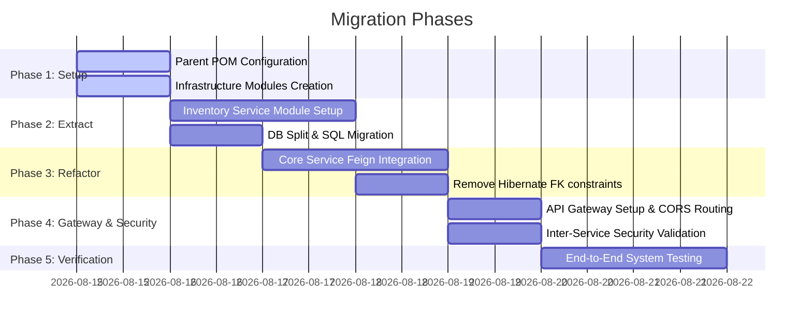

# Microservices Migration Plan (Spring Cloud, Eureka, Feign, Gateway, Admin Server)

This document outlines the system architecture, database design (ER diagram), API sequence flows, module structures, and implementation steps required to split the **Inventory Service** from the SmartServ backend and transition to a distributed microservices model.

---

## 1. System Architecture Diagram



---

## 2. Entity-Relationship (ER) Diagram & Database Separation

### Monolithic Database Design (Before)
Direct physical association and foreign key link.



### Decoupled Microservice Databases (After)

To decouple the services, we split the schema into two distinct databases. In the Core Database, `JOBCARD_ITEM` references the inventory product ID as a standard long column (`product_id`) without physical foreign keys or Jpa joins.

#### Database 1: Core Service Database (`smartserv`)


#### Database 2: Inventory Service Database (`smartserv_inventory`)


---

## 3. Sequence Flow Diagram: Adding Item to Job Card

This sequence diagram depicts how stock validation, lookup, and deduction occur across the service boundary.



---

## 4. Architectural Highlights & Decoupling Review

> [!IMPORTANT]
> **Database Decoupling & Foreign Keys**
> Separating the Inventory Service requires removing direct database relationships (like Hibernate `@ManyToOne` foreign key mappings) between `JobCardItem` (in the Core database) and `Inventory` (in the Inventory database).
> - We will replace `Inventory inventoryItem` in `JobCardItem` with `Long inventoryItemId`.
> - Queries joining `JobCardItem` and `Inventory` will be replaced by API composition, utilizing a Feign Client to query the Inventory Service by ID or list of IDs.
> - A data migration is required to split the tables and preserve references.

> [!WARNING]
> **Inter-service Security Propagation**
> Since all APIs are secured by JWT, inter-service Feign calls from the Core Service to the Inventory Service must pass along the user's JWT token or cookie. We will implement a `RequestInterceptor` in the Core Service to automatically forward the client's Authorization header and/or cookies.

> [!NOTE]
> **Read Path Efficiency (No Feign Calls for Read-only JobCard Views)**
> Because `JobCardItem` maintains snapshot fields (`snapshotItemName`, `snapshotPrice`, `totalPrice`) directly in its database table, retrieving job card details or compiling mechanic/manager dashboards **does not** require synchronous Feign queries to the Inventory Service. DTO mapping relies completely on the local snapshot.

---

## 5. Multi-Module Maven Project Structure

To maintain clean dependency compilation, the project will be restructured as a Multi-Module Maven project:

```
smartserv-microservices/ (Parent Directory)
│
├── pom.xml (Parent POM)
│
├── discovery-server/ (Eureka Server)
│   ├── pom.xml
│   └── src/main/java/com/smartserv/discovery/DiscoveryServerApplication.java
│
├── api-gateway/ (Spring Cloud Gateway)
│   ├── pom.xml
│   └── src/main/java/com/smartserv/gateway/ApiGatewayApplication.java
│
├── admin-server/ (Spring Boot Admin Server)
│   ├── pom.xml
│   └── src/main/java/com/smartserv/admin/AdminServerApplication.java
│
├── inventory-service/ (Extracted Service)
│   ├── pom.xml
│   └── src/main/java/com/smartserv/inventory/...
│
└── core-service/ (Existing Backend minus Inventory)
    ├── pom.xml
    └── src/main/java/com/smartserv/...
```

### Parent `pom.xml` Setup

The parent `pom.xml` coordinates dependencies, Java versions, and Spring Boot / Spring Cloud versions.

```xml
<?xml version="1.0" encoding="UTF-8"?>
<project xmlns="http://maven.apache.org/POM/4.0.0" 
         xmlns:xsi="http://www.w3.org/2001/XMLSchema-instance"
         xsi:schemaLocation="http://maven.apache.org/POM/4.0.0 https://maven.apache.org/xsd/maven-4.0.0.xsd">
    <modelVersion>4.0.0</modelVersion>
    
    <parent>
        <groupId>org.springframework.boot</groupId>
        <artifactId>spring-boot-starter-parent</artifactId>
        <version>3.5.16</version>
        <relativePath/> <!-- lookup parent from repository -->
    </parent>
    
    <groupId>com.smartserv</groupId>
    <artifactId>smartserv-parent</artifactId>
    <version>0.0.1-SNAPSHOT</version>
    <packaging>pom</packaging>
    <name>smartserv-parent</name>
    <description>Parent POM for SmartServ Microservices</description>
    
    <modules>
        <module>discovery-server</module>
        <module>api-gateway</module>
        <module>admin-server</module>
        <module>inventory-service</module>
        <module>core-service</module>
    </modules>
    
    <properties>
        <java.version>21</java.version>
        <spring-cloud.version>2025.0.0</spring-cloud.version>
        <spring-boot-admin.version>3.4.1</spring-boot-admin.version>
        <jjwt.version>0.13.0</jjwt.version>
        <modelmapper.version>3.2.6</modelmapper.version>
        <dotenv.version>4.0.0</dotenv.version>
    </properties>

    <dependencyManagement>
        <dependencies>
            <!-- Spring Cloud BOM -->
            <dependency>
                <groupId>org.springframework.cloud</groupId>
                <artifactId>spring-cloud-dependencies</artifactId>
                <version>${spring-cloud.version}</version>
                <type>pom</type>
                <scope>import</scope>
            </dependency>
            <!-- Spring Boot Admin Server BOM -->
            <dependency>
                <groupId>de.codecentric</groupId>
                <artifactId>spring-boot-admin-dependencies</artifactId>
                <version>${spring-boot-admin.version}</version>
                <type>pom</type>
                <scope>import</scope>
            </dependency>
        </dependencies>
    </dependencyManagement>
</project>
```

---

## 6. Infrastructure & Module Configurations

### 6.1 Discovery Server (`discovery-server`)

The Eureka server acts as the central service registry.

#### Dependecies (`discovery-server/pom.xml`)
```xml
<dependencies>
    <dependency>
        <groupId>org.springframework.cloud</groupId>
        <artifactId>spring-cloud-starter-netflix-eureka-server</artifactId>
    </dependency>
</dependencies>
```

#### Application Class
```java
package com.smartserv.discovery;

import org.springframework.boot.SpringApplication;
import org.springframework.boot.autoconfigure.SpringBootApplication;
import org.springframework.cloud.netflix.eureka.server.EnableEurekaServer;

@SpringBootApplication
@EnableEurekaServer
public class DiscoveryServerApplication {
    public static void main(String[] args) {
        SpringApplication.run(DiscoveryServerApplication.class, args);
    }
}
```

#### Properties (`discovery-server/src/main/resources/application.yml`)
```yaml
server:
  port: 8761

eureka:
  instance:
    hostname: localhost
  client:
    register-with-eureka: false
    fetch-registry: false
    service-url:
      defaultZone: http://${eureka.instance.hostname}:${server.port}/eureka/
```

---

### 6.2 API Gateway (`api-gateway`)

Routes client requests, consolidates CORS configuration, and acts as the edge gateway.

#### Dependencies (`api-gateway/pom.xml`)
```xml
<dependencies>
    <dependency>
        <groupId>org.springframework.cloud</groupId>
        <artifactId>spring-cloud-starter-gateway</artifactId>
    </dependency>
    <dependency>
        <groupId>org.springframework.cloud</groupId>
        <artifactId>spring-cloud-starter-netflix-eureka-client</artifactId>
    </dependency>
</dependencies>
```

#### Application Class
```java
package com.smartserv.gateway;

import org.springframework.boot.SpringApplication;
import org.springframework.boot.autoconfigure.SpringBootApplication;

@SpringBootApplication
public class ApiGatewayApplication {
    public static void main(String[] args) {
        SpringApplication.run(ApiGatewayApplication.class, args);
    }
}
```

#### Properties (`api-gateway/src/main/resources/application.yml`)
```yaml
server:
  port: 8080

spring:
  application:
    name: api-gateway
  cloud:
    gateway:
      discovery:
        locator:
          enabled: true
          lower-case-service-id: true
      routes:
        # Inventory Service Route
        - id: inventory-service
          uri: lb://inventory-service
          predicates:
            - Path=/api/inventory/**
        # Core Service Route
        - id: core-service
          uri: lb://core-service
          predicates:
            - Path=/api/auth/**, /api/appointments/**, /api/jobcard/**, /api/users/**, /api/vehicles/**, /api/invoices/**
      cors:
        cors-configurations:
          '[/**]':
            allowedOriginPatterns: "http://localhost:5173,http://127.0.0.1:5173,https://smart-serv-two.vercel.app"
            allowedMethods:
              - GET
              - POST
              - PUT
              - DELETE
              - OPTIONS
              - PATCH
            allowedHeaders: "*"
            allowCredentials: true
            exposedHeaders: "Authorization, Content-Type, X-Total-Count"

eureka:
  client:
    service-url:
      defaultZone: http://localhost:8761/eureka/
```

---

### 6.3 Admin Server (`admin-server`)

Provides dashboard monitoring of Spring Boot Actuator endpoints.

#### Dependencies (`admin-server/pom.xml`)
```xml
<dependencies>
    <dependency>
        <groupId>de.codecentric</groupId>
        <artifactId>spring-boot-admin-starter-server</artifactId>
    </dependency>
    <dependency>
        <groupId>org.springframework.cloud</groupId>
        <artifactId>spring-cloud-starter-netflix-eureka-client</artifactId>
    </dependency>
    <dependency>
        <groupId>org.springframework.boot</groupId>
        <artifactId>spring-boot-starter-security</artifactId>
    </dependency>
</dependencies>
```

#### Application Class
```java
package com.smartserv.admin;

import de.codecentric.boot.admin.server.config.EnableAdminServer;
import org.springframework.boot.SpringApplication;
import org.springframework.boot.autoconfigure.SpringBootApplication;

@SpringBootApplication
@EnableAdminServer
public class AdminServerApplication {
    public static void main(String[] args) {
        SpringApplication.run(AdminServerApplication.class, args);
    }
}
```

#### Properties (`admin-server/src/main/resources/application.yml`)
```yaml
server:
  port: 8083

spring:
  application:
    name: admin-server
  security:
    user:
      name: admin
      password: adminpassword # secure this in production environment

eureka:
  client:
    service-url:
      defaultZone: http://localhost:8761/eureka/
```

---

### 6.4 Core Backend Service (`core-service`)

This module holds the core functionalities (Auth, Users, Appointments, Vehicles, Job Cards, Invoices, Razorpay). It communicates with the Inventory Service using Feign.

#### Key Dependency Configurations
Include `spring-cloud-starter-openfeign` and `spring-cloud-starter-netflix-eureka-client`.

```xml
<dependencies>
    <dependency>
        <groupId>org.springframework.cloud</groupId>
        <artifactId>spring-cloud-starter-netflix-eureka-client</artifactId>
    </dependency>
    <dependency>
        <groupId>org.springframework.cloud</groupId>
        <artifactId>spring-cloud-starter-openfeign</artifactId>
    </dependency>
    <!-- Include existing core backend dependencies -->
</dependencies>
```

#### Properties (`core-service/src/main/resources/application.properties`)
```properties
server.port=8081
spring.application.name=core-service
spring.datasource.url=jdbc:mysql://${DB_HOST}/${DB_NAME_CORE}?createDatabaseIfNotExist=true
eureka.client.service-url.defaultZone=http://localhost:8761/eureka/

# Enable feign client compression and logging
feign.client.config.default.logger-level=full
```

---

### 6.5 Inventory Service (`inventory-service`)

Exposes APIs to CRUD inventory and handles stock adjustment requests from the Core Service.

#### Dependencies
Include security (for JWT verification), JPA, Web, and Eureka Client.

```xml
<dependencies>
    <dependency>
        <groupId>org.springframework.boot</groupId>
        <artifactId>spring-boot-starter-web</artifactId>
    </dependency>
    <dependency>
        <groupId>org.springframework.boot</groupId>
        <artifactId>spring-boot-starter-data-jpa</artifactId>
    </dependency>
    <dependency>
        <groupId>org.springframework.boot</groupId>
        <artifactId>spring-boot-starter-security</artifactId>
    </dependency>
    <dependency>
        <groupId>org.springframework.cloud</groupId>
        <artifactId>spring-cloud-starter-netflix-eureka-client</artifactId>
    </dependency>
    <!-- Include standard utilities (JJWT, lombok, dotenv) -->
</dependencies>
```

#### Properties (`inventory-service/src/main/resources/application.properties`)
```properties
server.port=8082
spring.application.name=inventory-service
spring.datasource.url=jdbc:mysql://${DB_HOST}/${DB_NAME_INVENTORY}?createDatabaseIfNotExist=true
eureka.client.service-url.defaultZone=http://localhost:8761/eureka/

# Secure token configurations matching Core Service JWT details
jwt.secret=${JWT_SECRET}
jwt.expiration=${JWT_EXPIRATION}
```

---

## 7. Feign Client & Request Interceptor Implementation

To enable inter-service communication and maintain security context, we define a Feign client and a JWT propagation interceptor.

### 7.1 Feign Client Interface (Core Service)

Create this class in `com.smartserv.client` or `com.smartserv.feign` within `core-service`.

```java
package com.smartserv.client;

import org.springframework.cloud.openfeign.FeignClient;
import org.springframework.http.ResponseEntity;
import org.springframework.web.bind.annotation.GetMapping;
import org.springframework.web.bind.annotation.PathVariable;
import org.springframework.web.bind.annotation.PutMapping;
import org.springframework.web.bind.annotation.RequestParam;

import com.smartserv.dto.inventory.InventoryResponseDto;

@FeignClient(name = "inventory-service", path = "/api/inventory")
public interface InventoryClient {

    @GetMapping("/{id}")
    InventoryResponseDto getItemById(@PathVariable("id") Long id);

    @PutMapping("/{id}/deduct-stock")
    ResponseEntity<Void> deductStock(@PathVariable("id") Long id, @RequestParam("quantity") Integer quantity);

    @PutMapping("/{id}/add-stock")
    ResponseEntity<Void> addStock(@PathVariable("id") Long id, @RequestParam("quantity") Integer quantity);
}
```

### 7.2 Feign Request Interceptor (JWT Propagation)

Propagates the client’s Authentication header and Cookie downstream.

```java
package com.smartserv.config;

import feign.RequestInterceptor;
import feign.RequestTemplate;
import jakarta.servlet.http.HttpServletRequest;
import org.springframework.stereotype.Component;
import org.springframework.web.context.request.RequestContextHolder;
import org.springframework.web.context.request.ServletRequestAttributes;

import java.util.Enumeration;

@Component
public class FeignClientInterceptor implements RequestInterceptor {

    @Override
    public void configure(RequestTemplate template) {
        ServletRequestAttributes attributes = (ServletRequestAttributes) RequestContextHolder.getRequestAttributes();
        if (attributes != null) {
            HttpServletRequest request = attributes.getRequest();
            
            // 1. Forward Authorization Header
            String authHeader = request.getHeader("Authorization");
            if (authHeader != null) {
                template.header("Authorization", authHeader);
            }

            // 2. Forward Cookies (specifically JWT Cookie if present)
            String cookieHeader = request.getHeader("Cookie");
            if (cookieHeader != null) {
                template.header("Cookie", cookieHeader);
            }
        }
    }
}
```

Enable Feign on Core Service Application Entry Class:
```java
@SpringBootApplication
@EnableFeignClients
public class CoreServiceApplication { ... }
```

---

## 8. Stock Adjustment Endpoints in Inventory Service

In the monolith, inventory quantities were updated via direct JPA operations in the Core Service. In the microservice model, `InventoryController` must expose specific endpoints to modify stock.

### 8.1 InventoryController Additions

Expose endpoints for stock deductions and additions.

```java
@PutMapping("/{id}/deduct-stock")
public ResponseEntity<Void> deductStock(@PathVariable Long id, @RequestParam Integer quantity) {
    inventoryService.deductStock(id, quantity);
    return ResponseEntity.ok().build();
}

@PutMapping("/{id}/add-stock")
public ResponseEntity<Void> addStock(@PathVariable Long id, @RequestParam Integer quantity) {
    inventoryService.addStock(id, quantity);
    return ResponseEntity.ok().build();
}
```

### 8.2 InventoryServiceImpl Logic (with Optimistic Locking)

Optimistic locking via JPA `@Version` handles concurrent deductions on the same item.

```java
@Override
@Transactional
public void deductStock(Long itemId, Integer quantity) {
    Inventory item = inventoryRepo.findById(itemId)
            .orElseThrow(() -> new ResourceNotFoundException("Inventory item not found."));

    if (item.isDeleted()) {
        throw new InvalidOperationException("Cannot modify stock of a deleted item.");
    }

    if (item.getStockQuantity() < quantity) {
        throw new InsufficientStockException("Insufficient stock. Available: " 
                + item.getStockQuantity() + ", requested: " + quantity);
    }

    try {
        item.setStockQuantity(item.getStockQuantity() - quantity);
        inventoryRepo.save(item);
        log.info("Deducted {} stock units from item ID {}. New stock: {}", quantity, itemId, item.getStockQuantity());
    } catch (OptimisticLockException e) {
        throw new StockConflictException("Stock conflict. The item was modified by another thread. Please retry.");
    }
}

@Override
@Transactional
public void addStock(Long itemId, Integer quantity) {
    Inventory item = inventoryRepo.findById(itemId)
            .orElseThrow(() -> new ResourceNotFoundException("Inventory item not found."));

    if (item.isDeleted()) {
        throw new InvalidOperationException("Cannot add stock to a deleted item.");
    }

    try {
        item.setStockQuantity(item.getStockQuantity() + quantity);
        inventoryRepo.save(item);
        log.info("Added {} stock units to item ID {}. New stock: {}", quantity, itemId, item.getStockQuantity());
    } catch (OptimisticLockException e) {
        throw new StockConflictException("Stock conflict. The item was modified by another thread. Please retry.");
    }
}
```

---

## 9. Core Service Entity & Service Refactoring

### 9.1 JobCardItem.java Entity Modification
Remove physical mapping and replace with a logical ID reference.

```diff
-   @ManyToOne(fetch = FetchType.LAZY)
-   @JoinColumn(name="product_id", nullable=false)
-   private Inventory inventoryItem;

+   @Column(name="product_id", nullable=false)
+   private Long inventoryItemId;
```

### 9.2 JobCardServiceImpl.java Adjustment

Replace direct JPA database calls to `inventoryRepo` with synchronous Feign Client calls to `inventoryClient`.

#### Refactored cancellation stock return:
```java
for (JobCardItem item : jobCard.getItems()) {
    // Invoke Inventory Service to add the stock back
    inventoryClient.addStock(item.getInventoryItemId(), item.getQuantity());
    log.info("returned {} units of product ID {} to inventory service.", item.getQuantity(), item.getInventoryItemId());
}
```

#### Refactored adding item to job card:
```java
// Feign client call replacing local Repo call
InventoryResponseDto inventoryItem = inventoryClient.getItemById(dto.getInventoryItemId());

if (inventoryItem.isDeleted()) {
    throw new InvalidOperationException("cannot use deleted inventory items");
}

if (inventoryItem.getStockQuantity() < dto.getQuantity()) {
    throw new InsufficientStockException(
            "Insufficient stock for " + inventoryItem.getItemName() + " available quantity is "
                    + inventoryItem.getStockQuantity() + ", requested quantity is " + dto.getQuantity());
}

JobCardItem jobCardItem = new JobCardItem();
jobCardItem.setJobCard(jobCard);
jobCardItem.setInventoryItemId(dto.getInventoryItemId()); // set logical reference id
jobCardItem.setQuantity(dto.getQuantity());
jobCardItem.setSnapshotItemName(inventoryItem.getItemName());
jobCardItem.setSnapshotPrice(inventoryItem.getCurrentPrice());
jobCardItem.setTotalPrice(inventoryItem.getCurrentPrice() * dto.getQuantity());

jobCard.getItems().add(jobCardItem);

// Call Feign client to deduct stock remotely
inventoryClient.deductStock(dto.getInventoryItemId(), dto.getQuantity());
```

---

## 10. Database Schema Split & Data Migration Strategy

To successfully migrate without data loss, follow this procedure:

### Step 1: Export Current Inventory Data
Run a command to dump the `inventory` table from the monolithic database.
```bash
mysqldump -u [username] -p [password] --host=[host] smartserv inventory > inventory_table_dump.sql
```

### Step 2: Create the new database schema
Create the `smartserv_inventory` database instance on your server.
```sql
CREATE DATABASE smartserv_inventory;
```

### Step 3: Import Inventory Table
Import the exported SQL dump into the new `smartserv_inventory` database.
```bash
mysql -u [username] -p [password] --host=[host] smartserv_inventory < inventory_table_dump.sql
```

### Step 4: Drop Foreign Key and Table in Core Database
Run these scripts on the core `smartserv` database to drop the foreign key mapping and cleanup.
```sql
-- Identify the foreign key constraint name
SELECT CONSTRAINT_NAME 
FROM INFORMATION_SCHEMA.KEY_COLUMN_USAGE 
WHERE TABLE_NAME = 'job_card_item' AND COLUMN_NAME = 'product_id';

-- Drop the foreign key constraint
ALTER TABLE job_card_item DROP FOREIGN KEY [CONSTRAINT_NAME];

-- Drop the unused inventory table from core database
DROP TABLE inventory;
```

---

## 11. Step-by-Step Implementation Sequence

Execute the migration plan in these specific phases:



### Phase 1: Setup & Infrastructure
1. Rename current workspace folder contents or initialize `core-service/` sub-module directory.
2. Create `discovery-server`, `api-gateway`, and `admin-server` directories.
3. Configure the parent `pom.xml` in the root workspace.
4. Establish basic bootstrap properties for Eureka, Spring Cloud Gateway, and Admin Server.

### Phase 2: Inventory Service Extraction
1. Extract files from `core` packages to the `inventory-service` module (entity, controllers, repositories, services, and security packages related to inventory).
2. Implement stock addition (`/add-stock`) and deduction (`/deduct-stock`) endpoints in the service.
3. Configure `inventory-service` properties to point to the new database `smartserv_inventory`.

### Phase 3: Core Service Refactoring
1. Add Spring Cloud Eureka and Feign client dependencies to `core-service`.
2. Refactor `JobCardItem.java` to use a `Long` logical ID column `product_id`.
3. Create `InventoryClient` and `FeignClientInterceptor`.
4. Replace internal references of `InventoryRepository` in `JobCardServiceImpl` with `InventoryClient`.

### Phase 4: Database & Gateway Integration
1. Execute database dump, schema creation, data import, and drop foreign key queries.
2. Launch Eureka server and confirm registration.
3. Start API Gateway and configure routing rules to proxy requests properly.
4. Spin up Core and Inventory services; monitor registration status in the Eureka Dashboard (`http://localhost:8761`).

### Phase 5: Verification & Testing
1. Verify REST endpoints through API Gateway (`http://localhost:8080/api/inventory` and `http://localhost:8080/api/jobcard`).
2. Test JWT validation of downstream services by hitting APIs with and without authorization headers/cookies.
3. Run concurrent tests on adding items to a job card to verify optimistic locking (`@Version`) behavior in the Inventory database.
4. Review logs in Spring Boot Admin Console (`http://localhost:8083`) to confirm metrics.
