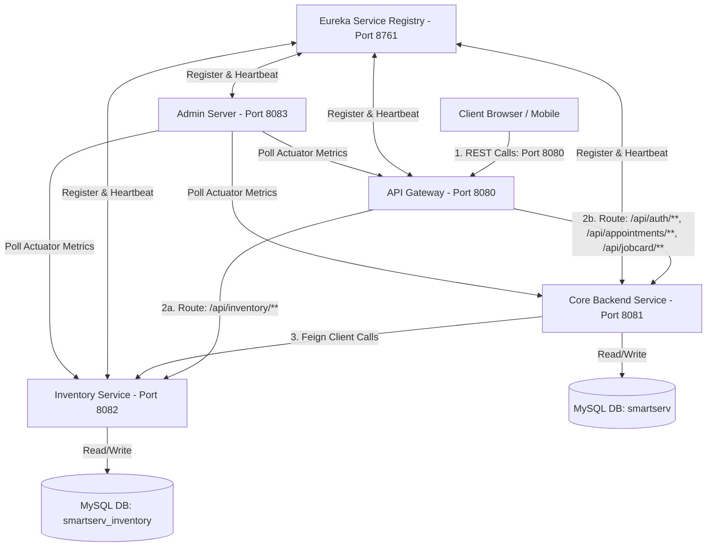
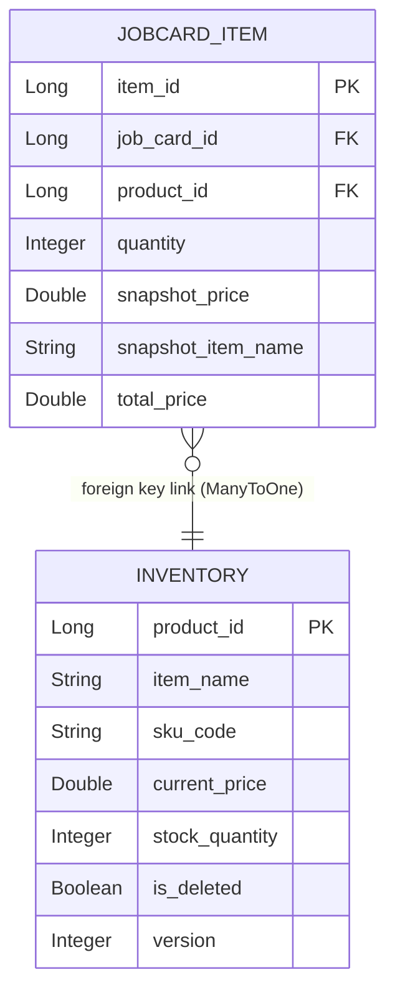
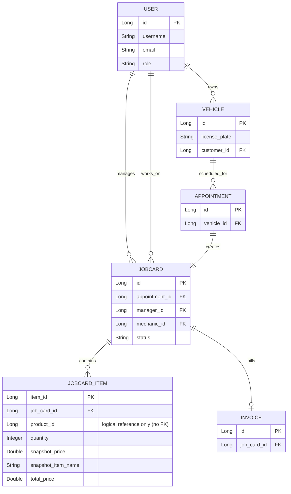
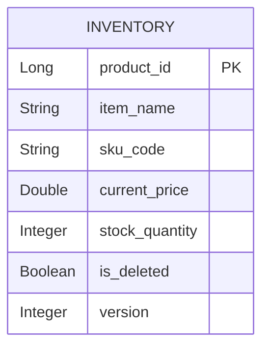
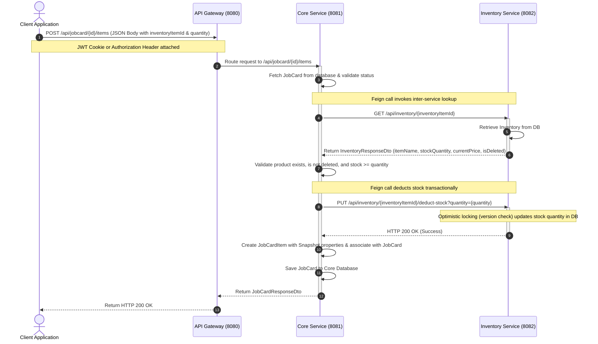

# Microservices Migration Plan (Spring Cloud, Eureka, Feign, Gateway, Admin Server)

This document outlines the system architecture, database design (ER diagram), API sequence flows, module structures, and implementation steps required to split the **Inventory Service** from the SmartServ backend and transition to a distributed microservices model.

---

## 1. System Architecture Diagram



---

## 2. Entity-Relationship (ER) Diagram & Database Separation

### Monolithic Database Design (Before)
Direct physical association and foreign key link.



### Decoupled Microservice Databases (After)

To decouple the services, we split the schema into two distinct databases. In the Core Database, `JOBCARD_ITEM` references the inventory product ID as a standard long column (`product_id`) without physical foreign keys or Jpa joins.

#### Database 1: Core Service Database (`smartserv`)


#### Database 2: Inventory Service Database (`smartserv_inventory`)


---

## 3. Sequence Flow Diagram: Adding Item to Job Card

This sequence diagram depicts how stock validation, lookup, and deduction occur across the service boundary.



---

## 4. User Review Required

> [!IMPORTANT]
> **Database Decoupling & Foreign Keys**
> Separating the Inventory Service requires removing direct database relationships (like Hibernate `@ManyToOne` foreign key mappings) between `JobCardItem` (in the Core database) and `Inventory` (in the Inventory database).
> - We will replace `Inventory inventoryItem` in `JobCardItem` with `Long inventoryItemId`.
> - Queries joining `JobCardItem` and `Inventory` will be replaced by API composition, utilizing a Feign Client to query the Inventory Service by ID or list of IDs.
> - A data migration is required to split the tables and preserve references.

> [!WARNING]
> **Inter-service Security Propagation**
> Since all APIs are secured by JWT, inter-service Feign calls from the Core Service to the Inventory Service must pass along the user's JWT token or cookie. We will implement a `RequestInterceptor` in the Core Service to automatically forward the client's Authorization header and/or cookies.
```
