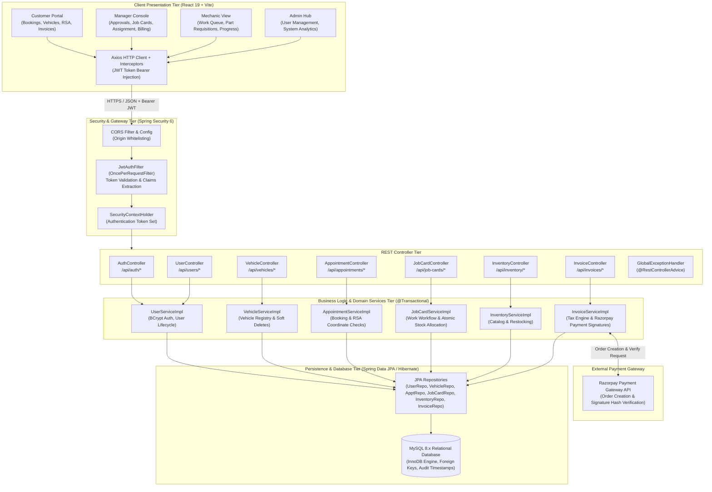
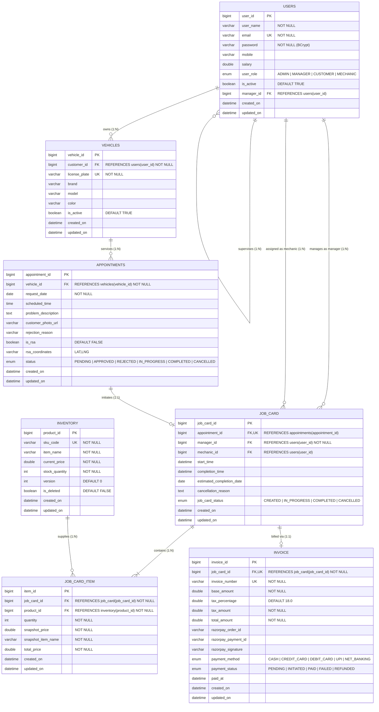
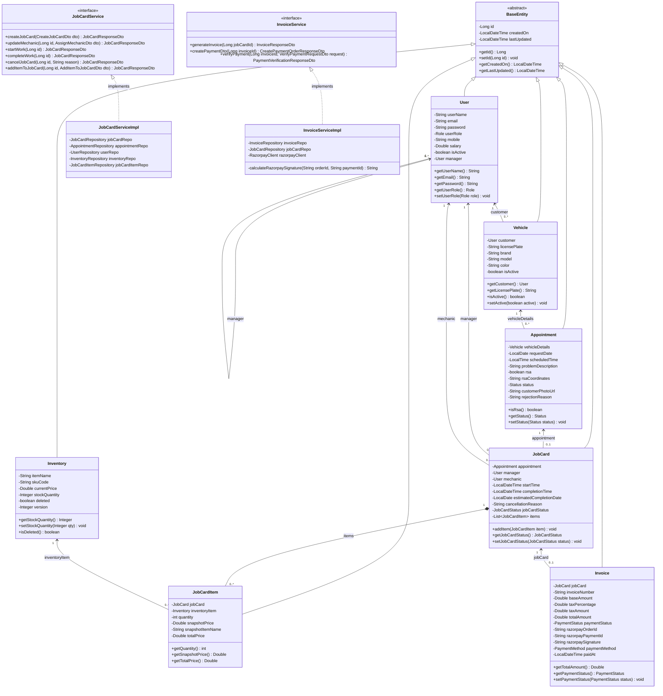
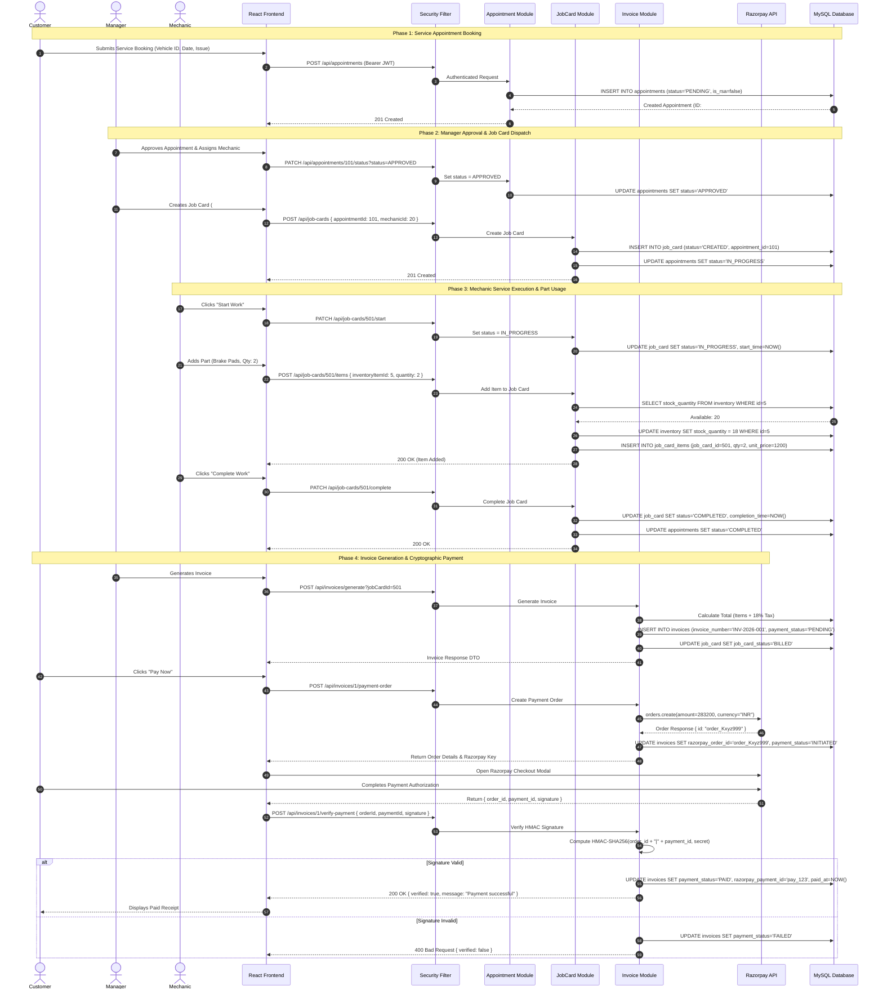
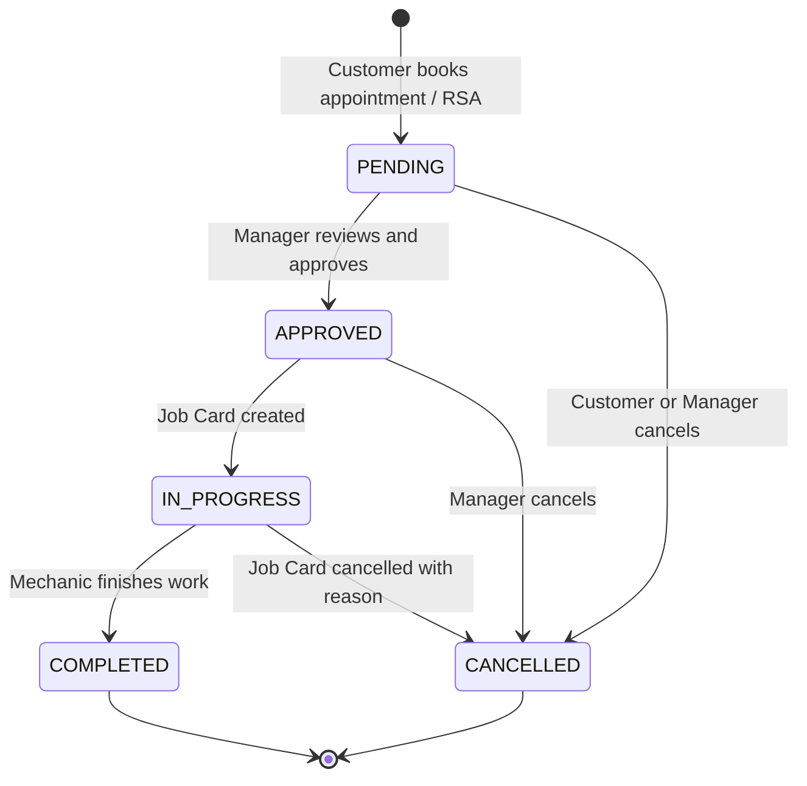
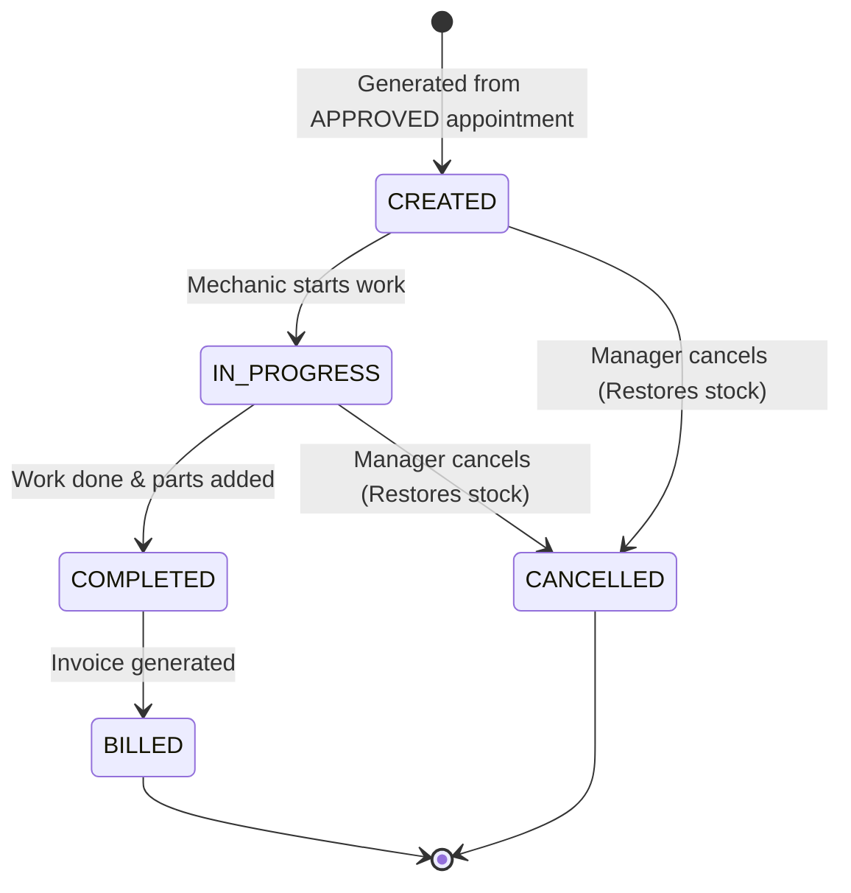
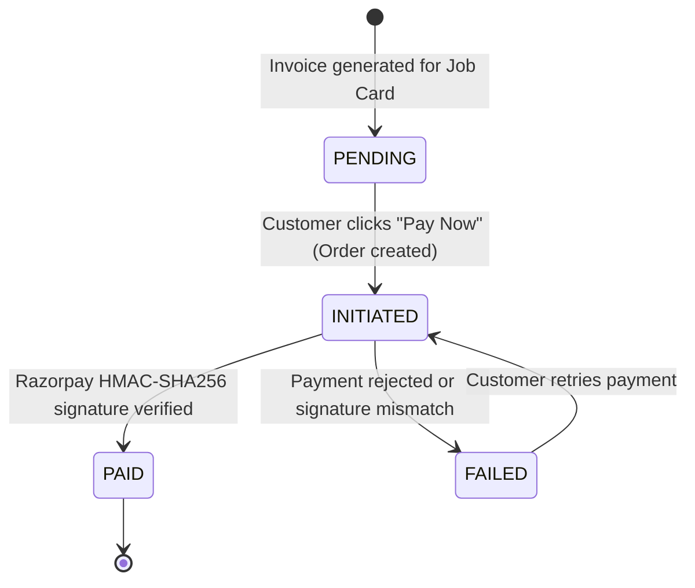

# System Architecture & UML Diagrams (Mermaid Code)
**SmartServ – Enterprise Automobile Service Management Platform**
*Comprehensive Visual Specifications & GitHub-Compatible Mermaid Diagrams*

---

## Table of Contents
1. [High-Level System Architecture & Data Flow Diagram (DFD)](#1-high-level-system-architecture--data-flow-diagram-dfd)
2. [Database Entity Relationship (ER) Diagram](#2-database-entity-relationship-er-diagram)
3. [UML Class Diagram & Relationships](#3-uml-class-diagram--relationships)
4. [Primary End-to-End Lifecycle Sequence Diagram](#4-primary-end-to-end-lifecycle-sequence-diagram)
5. [State Machine Diagrams](#5-state-machine-diagrams)

---

## 1. High-Level System Architecture & Data Flow Diagram (DFD)

This diagram visualizes the multi-tier architectural topology, network boundaries, security filter interception, REST controllers, service transactions, and third-party integrations (Razorpay).

---

## 2. Database Entity Relationship (ER) Diagram

This diagram displays the relational database schema, data types, constraints, primary keys (PK), foreign keys (FK), and cardinalities.

---

## 3. UML Class Diagram & Relationships

This diagram depicts the Object-Oriented structure of domain entities, inheritance from `BaseEntity`, service interfaces, and service implementations.

---

## 4. Primary End-to-End Lifecycle Sequence Diagram

This sequence diagram depicts the complete business transaction flow: **Customer Registration $\rightarrow$ Booking $\rightarrow$ Manager Approval $\rightarrow$ Mechanic Repair with Stock Deduction $\rightarrow$ Invoice Generation $\rightarrow$ Razorpay Payment Verification**.

---

## 5. State Machine Diagrams

### 5.1 Appointment State Lifecycle

### 5.2 Job Card State Lifecycle

### 5.3 Invoice Payment State Lifecycle

